# 100マス計算 の つかいかた

このページは、100マス<ruby>計算<rt>けいさん</rt></ruby>を はじめて ひらく人の ための つかいかたです。
<ruby>画面<rt>がめん</rt></ruby>の <ruby>絵<rt>え</rt></ruby>と 見くらべながら、上から じゅんに <ruby>読<rt>よ</rt></ruby>んでください。

## 100マス<ruby>計算<rt>けいさん</rt></ruby>で できること（つかう人と <ruby>用意<rt>ようい</rt></ruby>する もの）

ここでは、この アプリで <ruby>何<rt>なに</rt></ruby>が できるのかと、はじめる まえに <ruby>用意<rt>ようい</rt></ruby>する ものを <ruby>説明<rt>せつめい</rt></ruby>します。

### 100マス<ruby>計算<rt>けいさん</rt></ruby>は どんな アプリ？

ブラウザで ひらくだけで つかえる、<ruby>計算<rt>けいさん</rt></ruby>の れんしゅう アプリです。
たし<ruby>算<rt>ざん</rt></ruby>・<ruby>引<rt>ひ</rt></ruby>き<ruby>算<rt>ざん</rt></ruby>・かけ<ruby>算<rt>ざん</rt></ruby>を、<ruby>時間<rt>じかん</rt></ruby>を はかりながら ときます。
アプリを ダウンロードしたり、ID や パスワードを つくったりする ひつようは ありません。

<ruby>名前<rt>なまえ</rt></ruby>も <ruby>出席番号<rt>しゅっせきばんごう</rt></ruby>も 入れません。1<ruby>回<rt>かい</rt></ruby> ひらいたあとは、インターネットに つながっていなくても つかえます。

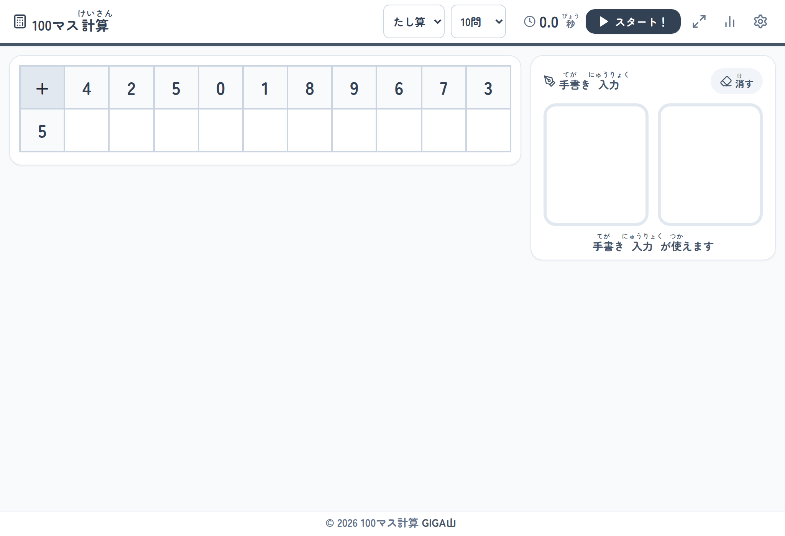

これが さいしょに 出る <ruby>画面<rt>がめん</rt></ruby>です。

### つかう人と、<ruby>用意<rt>ようい</rt></ruby>する もの

つかうのは <ruby>小学校<rt>しょうがっこう</rt></ruby>の 1<ruby>年生<rt>ねんせい</rt></ruby>から 6<ruby>年生<rt>ねんせい</rt></ruby>です。おうちの人や 先生と いっしょでも、ひとりでも つかえます。

<ruby>用意<rt>ようい</rt></ruby>する ものは、つぎの とおりです。

- タブレット か パソコン（Chromebook・iPad・Windows のどれでも つかえます）
- ブラウザ（Chrome・Safari・Edge のどれか）
- ひらく アドレス。 https://online-100square-calculation.giga-school.com/
- はじめて <ruby>手書<rt>てが</rt></ruby>きを つかう ときだけ、インターネットに つながる ところ

ID・パスワード・メールアドレスは いりません。

### 出てくる <ruby>計算<rt>けいさん</rt></ruby>と、もんだいの <ruby>数<rt>かず</rt></ruby>

出てくる <ruby>計算<rt>けいさん</rt></ruby>は 3つです。

- たし<ruby>算<rt>ざん</rt></ruby>。0から9 に 0から9 を たします。<ruby>答<rt>こた</rt></ruby>えは 0から18 です
- <ruby>引<rt>ひ</rt></ruby>き<ruby>算<rt>ざん</rt></ruby>。10から19 から 0から9 を ひきます。<ruby>答<rt>こた</rt></ruby>えは 1から19 です
- かけ<ruby>算<rt>ざん</rt></ruby>。0から9 に 0から9 を かけます。九九と、0の だんが 出ます。<ruby>答<rt>こた</rt></ruby>えは 0から81 です

もんだいの <ruby>数<rt>かず</rt></ruby>は、10<ruby>問<rt>もん</rt></ruby>から 100<ruby>問<rt>もん</rt></ruby>まで、10<ruby>問<rt>もん</rt></ruby>ずつ えらべます。
10<ruby>問<rt>もん</rt></ruby>なら 1<ruby>行<rt>ぎょう</rt></ruby>、100<ruby>問<rt>もん</rt></ruby>なら 10<ruby>行<rt>ぎょう</rt></ruby>に なります。よこは いつも 10れつです。

上に ならぶ 10この <ruby>数<rt>かず</rt></ruby>は、<ruby>毎回<rt>まいかい</rt></ruby> 0から9 を まぜて ならべます。
左に ならぶ <ruby>数<rt>かず</rt></ruby>は 1<ruby>行<rt>ぎょう</rt></ruby>ずつ えらび<ruby>直<rt>なお</rt></ruby>すので、おなじ <ruby>数<rt>かず</rt></ruby>が 2つの <ruby>行<rt>ぎょう</rt></ruby>に 出ることも あります。

【！】<ruby>覚<rt>おぼ</rt></ruby>えておいて ほしいこと:

- <ruby>数<rt>かず</rt></ruby>の ならびは <ruby>毎回<rt>まいかい</rt></ruby> つくり<ruby>直<rt>なお</rt></ruby>します。おなじ ばんめんを おぼえてしまう ことは ありません
- おなじ <ruby>数<rt>かず</rt></ruby>が 2つの <ruby>行<rt>ぎょう</rt></ruby>に 出たときも、べつべつの もんだいとして <ruby>数<rt>かぞ</rt></ruby>えます

## はじめて ひらいたときに すること（さいしょの 1<ruby>回<rt>かい</rt></ruby>だけ）

ここに <ruby>書<rt>か</rt></ruby>いてあるのは、さいしょの 1<ruby>回<rt>かい</rt></ruby>だけ やることです。2<ruby>回目<rt>かいめ</rt></ruby>からは、アドレスを ひらくだけで はじめられます。

### ブラウザで アドレスを ひらく

1. Chrome か Safari か Edge を ひらいてください。
2. アドレスを 入れる ところに、上の アドレスを 入れて ひらいてください。
3. 「100マス<ruby>計算<rt>けいさん</rt></ruby>」と <ruby>書<rt>か</rt></ruby>いてある <ruby>画面<rt>がめん</rt></ruby>が 出たら、<ruby>準備<rt>じゅんび</rt></ruby>は できています。

先生から わたされた リンクや、<ruby>二次元<rt>にじげん</rt></ruby>コードから ひらいても <ruby>同<rt>おな</rt></ruby>じです。

### 【<ruby>重要<rt>じゅうよう</rt></ruby>】タブレットや パソコンに アプリとして 入れる

ホーム<ruby>画面<rt>がめん</rt></ruby>や デスクトップに 入れておくと、つぎからは アイコンから ひらけます。
インターネットに つながっていなくても ひらけるように なります。

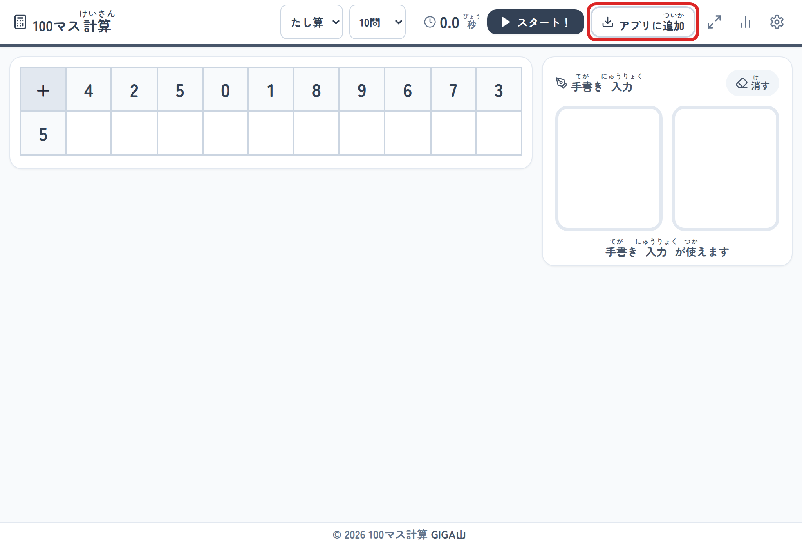

赤い わくの ボタンから 入れられます。

Chromebook・Windows で 入れる <ruby>手順<rt>てじゅん</rt></ruby>:

1. <ruby>画面<rt>がめん</rt></ruby>の 上に 「アプリに<ruby>追加<rt>ついか</rt></ruby>」の ボタンが 出たら、おしてください。
2. 「インストール」を おしてください。

ボタンが 出ないときは、アドレスを 入れる ところの 右はしに ある <ruby>丸<rt>まる</rt></ruby>い しるしか、
ブラウザの メニューの 「アプリをインストール」からでも 入れられます。

iPad・iPhone の Safari で 入れる <ruby>手順<rt>てじゅん</rt></ruby>:

1. <ruby>画面<rt>がめん</rt></ruby>の 下（または <ruby>右上<rt>みぎうえ</rt></ruby>）に ある <ruby>共有<rt>きょうゆう</rt></ruby>の ボタン（<ruby>四角<rt>しかく</rt></ruby>から 上に やじるしが 出た しるし）を おしてください。
2. メニューを 下に <ruby>送<rt>おく</rt></ruby>って、「ホーム<ruby>画面<rt>がめん</rt></ruby>に<ruby>追加<rt>ついか</rt></ruby>」を おしてください。
3. <ruby>右上<rt>みぎうえ</rt></ruby>の 「<ruby>追加<rt>ついか</rt></ruby>」を おしてください。

【！】<ruby>覚<rt>おぼ</rt></ruby>えておいて ほしいこと:

- 入れなくても つかえます。入れると はやく ひらけるように なるだけです
- iPad は、7日 つかわないと 中の <ruby>記録<rt>きろく</rt></ruby>を <ruby>消<rt>け</rt></ruby>してしまうことが あります。ホーム<ruby>画面<rt>がめん</rt></ruby>に 入れておくと <ruby>消<rt>き</rt></ruby>えにくく なります
- すでに 入れてある ときは、「アプリに<ruby>追加<rt>ついか</rt></ruby>」の ボタンは 出ません

### <ruby>手書<rt>てが</rt></ruby>きを つかう人は、つながる ところで 1<ruby>回<rt>かい</rt></ruby> ためす

<ruby>手書<rt>てが</rt></ruby>きの <ruby>読<rt>よ</rt></ruby>みとりに つかう <ruby>部品<rt>ぶひん</rt></ruby>は、はじめて <ruby>手書<rt>てが</rt></ruby>きを つかった ときに、インターネットから <ruby>取<rt>と</rt></ruby>りにいきます。
1<ruby>回<rt>かい</rt></ruby> つかえば その <ruby>機械<rt>きかい</rt></ruby>の 中に のこるので、つぎからは つながっていなくても <ruby>手書<rt>てが</rt></ruby>きが つかえます。

みんなで つかう まえに、つながる ところで 1<ruby>回<rt>かい</rt></ruby> <ruby>手書<rt>てが</rt></ruby>きを ためしておくと あんしんです。

## <ruby>画面<rt>がめん</rt></ruby>の みかた（どこに <ruby>何<rt>なに</rt></ruby>が あるか）

<ruby>画面<rt>がめん</rt></ruby>は 3つの ところに <ruby>分<rt>わ</rt></ruby>かれています。どこに <ruby>何<rt>なに</rt></ruby>が あるかを 先に 見ておきましょう。

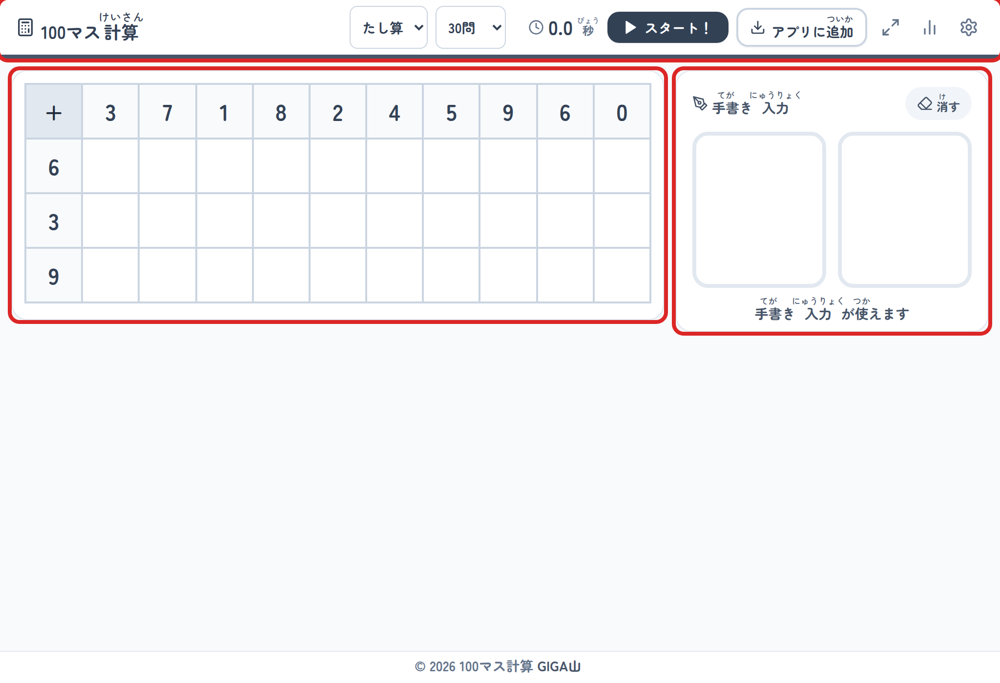

上の バー、まん中の ひょう、右の どうぐです。

### いちばん 上の バーに ある もの

<ruby>画面<rt>がめん</rt></ruby>の いちばん 上に ある よこながの バーに、えらぶ ところと ボタンが ならんでいます。
とりくんでいる あいだも、ここは ずっと 見えています。

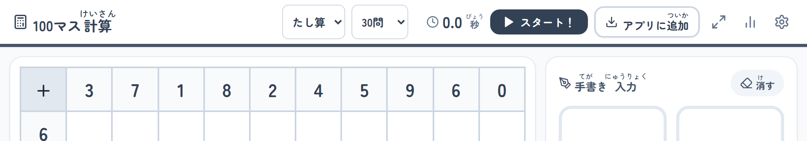

左から じゅんに ならんでいます。

上の バーには、左から つぎの ものが ならんでいます。

- 100マス<ruby>計算<rt>けいさん</rt></ruby>。この アプリの <ruby>名前<rt>なまえ</rt></ruby>です
- <ruby>計算<rt>けいさん</rt></ruby>の しゅるいを えらぶ ところ。たし<ruby>算<rt>ざん</rt></ruby>・<ruby>引<rt>ひ</rt></ruby>き<ruby>算<rt>ざん</rt></ruby>・かけ<ruby>算<rt>ざん</rt></ruby>
- もんだいの <ruby>数<rt>かず</rt></ruby>を えらぶ ところ。10<ruby>問<rt>もん</rt></ruby>から 100<ruby>問<rt>もん</rt></ruby>まで
- かかった <ruby>時間<rt>じかん</rt></ruby>。<ruby>秒<rt>びょう</rt></ruby>で 出ます
- スタート！。ここを おすと はじまります
- アプリに<ruby>追加<rt>ついか</rt></ruby>。この <ruby>機械<rt>きかい</rt></ruby>に 入れられる ときだけ 出ます
- 大きく<ruby>表示<rt>ひょうじ</rt></ruby>する。<ruby>画面<rt>がめん</rt></ruby>ぜんたいを 大きくします
- これまでの<ruby>記録<rt>きろく</rt></ruby>をみる。ぼうグラフの しるしです
- <ruby>設定<rt>せってい</rt></ruby>をひらく。はぐるまの しるしです

とりくんでいる あいだは、「スタート！」の ところが 「やめる」に かわります。
おわった あとは 「もう<ruby>一度<rt>いちど</rt></ruby>」に かわります。

### まん中の マスの ひょう

まん中の 大きな ひょうが、<ruby>答<rt>こた</rt></ruby>えを 入れる ところです。
上の <ruby>数<rt>かず</rt></ruby>と 左の <ruby>数<rt>かず</rt></ruby>を 見て、そのマスに <ruby>答<rt>こた</rt></ruby>えを 入れます。

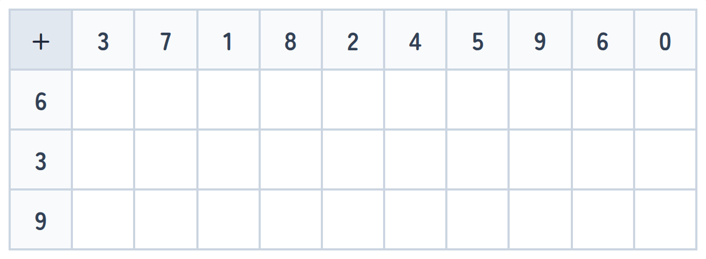

<ruby>左上<rt>ひだりうえ</rt></ruby>の しるしが、いまの <ruby>計算<rt>けいさん</rt></ruby>の しゅるいです。

ひょうの 見かたは つぎの とおりです。

- <ruby>左上<rt>ひだりうえ</rt></ruby>の しるし。たし<ruby>算<rt>ざん</rt></ruby>なら ＋、<ruby>引<rt>ひ</rt></ruby>き<ruby>算<rt>ざん</rt></ruby>なら −、かけ<ruby>算<rt>ざん</rt></ruby>なら × が 出ます
- 上の <ruby>行<rt>ぎょう</rt></ruby>の <ruby>数<rt>かず</rt></ruby>と、左の <ruby>列<rt>れつ</rt></ruby>の <ruby>数<rt>かず</rt></ruby>を 見て <ruby>計算<rt>けいさん</rt></ruby>します
- まん中の あいている ところが、<ruby>答<rt>こた</rt></ruby>えを 入れる マスです
- いま <ruby>答<rt>こた</rt></ruby>える マスには、こい わくが つきます

### 右がわの <ruby>入力<rt>にゅうりょく</rt></ruby>どうぐ

<ruby>答<rt>こた</rt></ruby>えを 入れる どうぐは、はじめは <ruby>画面<rt>がめん</rt></ruby>の 右がわに 出ます。

はじめは <ruby>手書<rt>てが</rt></ruby>き<ruby>入力<rt>にゅうりょく</rt></ruby>が 出ています。

- <ruby>手書<rt>てが</rt></ruby>き<ruby>入力<rt>にゅうりょく</rt></ruby>。<ruby>指<rt>ゆび</rt></ruby>や タッチペンで <ruby>数字<rt>すうじ</rt></ruby>を <ruby>書<rt>か</rt></ruby>いて 入れます
- ボタン<ruby>入力<rt>にゅうりょく</rt></ruby>。<ruby>画面<rt>がめん</rt></ruby>の <ruby>数字<rt>すうじ</rt></ruby>ボタンを おして 入れます
- <ruby>設定<rt>せってい</rt></ruby>で、どちらを 出すか、<ruby>両方<rt>りょうほう</rt></ruby> 出すかを えらべます
- <ruby>設定<rt>せってい</rt></ruby>で、右がわではなく 左がわに おくことも できます

## <ruby>計算<rt>けいさん</rt></ruby>の しゅるいと もんだいの <ruby>数<rt>かず</rt></ruby>を えらんで はじめる

とりくんでいる あいだは えらべません。はじめる まえに えらんでください。

### たし<ruby>算<rt>ざん</rt></ruby>・<ruby>引<rt>ひ</rt></ruby>き<ruby>算<rt>ざん</rt></ruby>・かけ<ruby>算<rt>ざん</rt></ruby>を えらぶ

<ruby>計算<rt>けいさん</rt></ruby>の しゅるいは、上の バーの まん中あたりで えらびます。

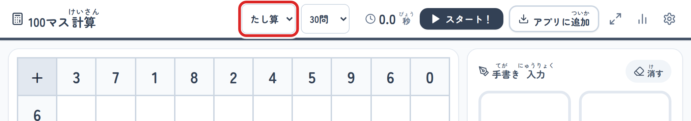

赤い わくの ところで えらびます。

1. 上の バーの 「たし<ruby>算<rt>ざん</rt></ruby>」と <ruby>書<rt>か</rt></ruby>いてある ところを おしてください。
2. 「たし<ruby>算<rt>ざん</rt></ruby>」「<ruby>引<rt>ひ</rt></ruby>き<ruby>算<rt>ざん</rt></ruby>」「かけ<ruby>算<rt>ざん</rt></ruby>」の 中から えらんでください。

えらぶと、ひょうの <ruby>数<rt>かず</rt></ruby>が すぐ 入れかわります。

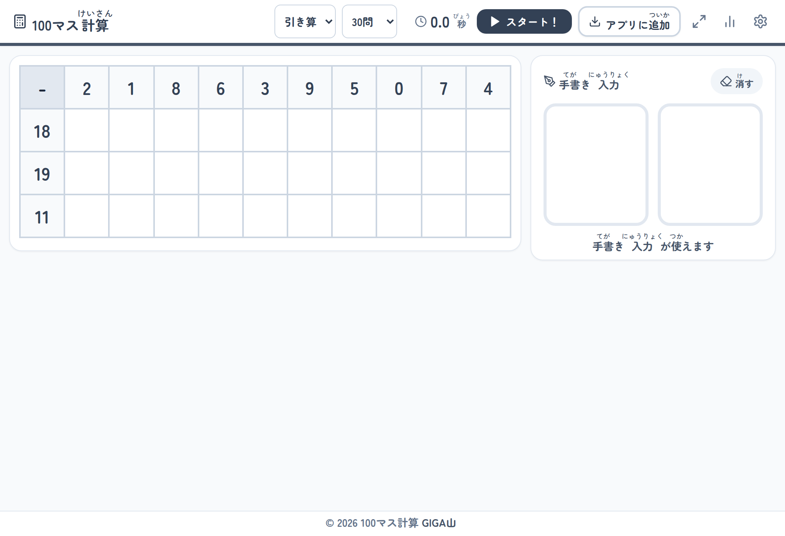

<ruby>引<rt>ひ</rt></ruby>き<ruby>算<rt>ざん</rt></ruby>では 左の <ruby>数<rt>かず</rt></ruby>が 10から19 に なります。

### もんだいの <ruby>数<rt>かず</rt></ruby>を えらぶ

もんだいの <ruby>数<rt>かず</rt></ruby>は、<ruby>計算<rt>けいさん</rt></ruby>の しゅるいの 右どなりで えらびます。

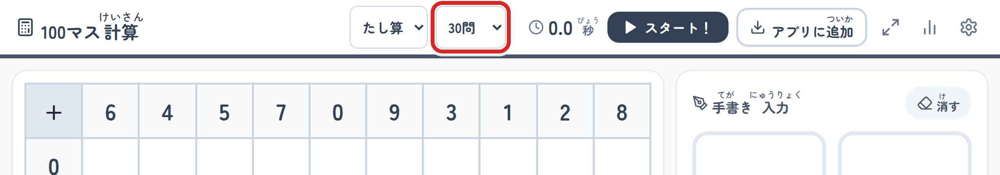

赤い わくの ところで えらびます。

1. 上の バーの 「10<ruby>問<rt>もん</rt></ruby>」と <ruby>書<rt>か</rt></ruby>いてある ところを おしてください。
2. 10<ruby>問<rt>もん</rt></ruby>から 100<ruby>問<rt>もん</rt></ruby>まで、10<ruby>問<rt>もん</rt></ruby>ずつ えらんでください。

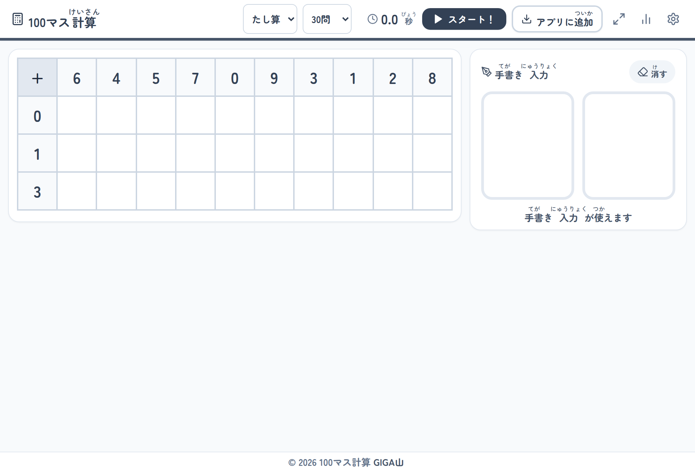

30<ruby>問<rt>もん</rt></ruby>に すると、<ruby>行<rt>ぎょう</rt></ruby>が 3つに なります。

はじめは 10<ruby>問<rt>もん</rt></ruby>か 20<ruby>問<rt>もん</rt></ruby>から やってみて、なれてきたら ふやすと よいです。

### 「スタート！」を おして はじめる

<ruby>計算<rt>けいさん</rt></ruby>の しゅるいと もんだいの <ruby>数<rt>かず</rt></ruby>を えらび おわったら、はじめます。

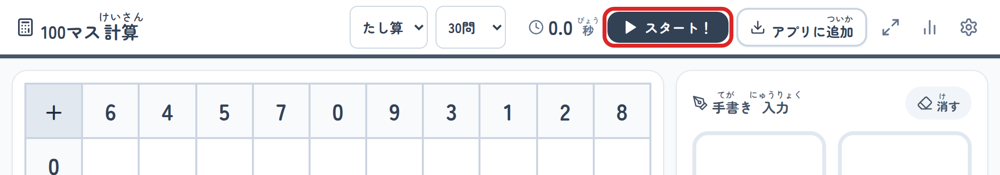

赤い わくの ボタンで はじまります。

1. 上の バーの 「スタート！」を おしてください。
2. <ruby>時間<rt>じかん</rt></ruby>が うごきだして、いちばん <ruby>左上<rt>ひだりうえ</rt></ruby>の マスが えらばれます。

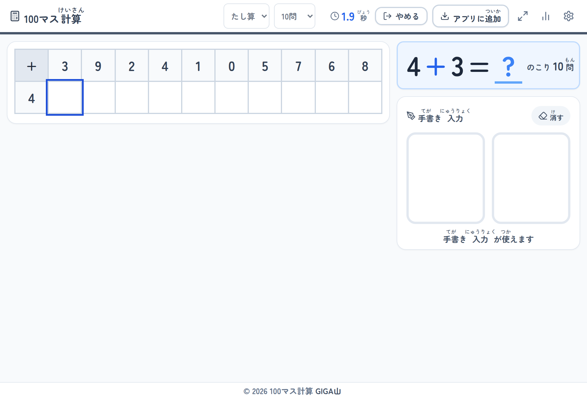

<ruby>時間<rt>じかん</rt></ruby>が うごきだしました。

【！】<ruby>覚<rt>おぼ</rt></ruby>えておいて ほしいこと:

- とりくんでいる あいだは、<ruby>計算<rt>けいさん</rt></ruby>の しゅるいも もんだいの <ruby>数<rt>かず</rt></ruby>も かえられません
- とちゅうで やめたい ときは、「やめる」を おします

### いま <ruby>答<rt>こた</rt></ruby>える <ruby>計算<rt>けいさん</rt></ruby>と、のこりの <ruby>数<rt>かず</rt></ruby>を 見る

とりくんでいる あいだ、<ruby>入力<rt>にゅうりょく</rt></ruby>どうぐの すぐ 上に 「いま とく <ruby>計算<rt>けいさん</rt></ruby>」が 出ます。
その 右には 「のこり <ruby>何問<rt>なんもん</rt></ruby>」かが 出ます。

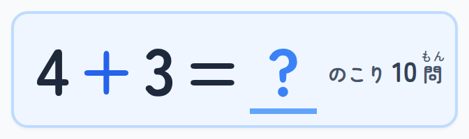

<ruby>式<rt>しき</rt></ruby>と、あと <ruby>何問<rt>なんもん</rt></ruby> のこっているかが 出ます。

ここを 見れば、ひょうから 目を はなさずに、いま <ruby>何<rt>なん</rt></ruby>の <ruby>計算<rt>けいさん</rt></ruby>を しているかが <ruby>分<rt>わ</rt></ruby>かります。

## <ruby>答<rt>こた</rt></ruby>えを <ruby>手書<rt>てが</rt></ruby>きで 入れる

はじめの <ruby>設定<rt>せってい</rt></ruby>では、<ruby>手書<rt>てが</rt></ruby>き<ruby>入力<rt>にゅうりょく</rt></ruby>が つかえるように なっています。

### <ruby>手書<rt>てが</rt></ruby>きの わくに <ruby>数字<rt>すうじ</rt></ruby>を <ruby>書<rt>か</rt></ruby>く

<ruby>手書<rt>てが</rt></ruby>きの わくは、<ruby>答<rt>こた</rt></ruby>えを 入れる ための 小さな ノートです。
ここに <ruby>書<rt>か</rt></ruby>いた <ruby>数字<rt>すうじ</rt></ruby>を、アプリが <ruby>読<rt>よ</rt></ruby>みとって マスに 入れます。

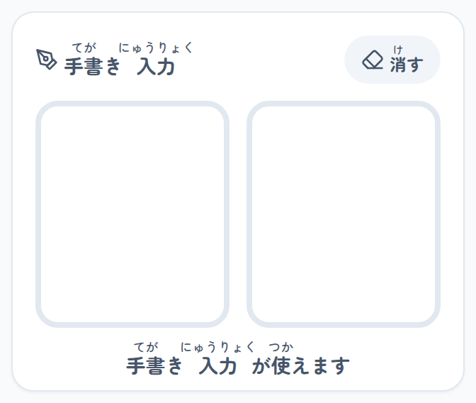

わくは 左と 右に 2つ あります。

<ruby>書<rt>か</rt></ruby>きかたの <ruby>手順<rt>てじゅん</rt></ruby>:

1. <ruby>答<rt>こた</rt></ruby>えを 入れたい マスを おして、こい わくを つけてください。
2. <ruby>手書<rt>てが</rt></ruby>きの わくの 中に、<ruby>指<rt>ゆび</rt></ruby>か タッチペンで 大きく <ruby>書<rt>か</rt></ruby>いてください。
3. <ruby>指<rt>ゆび</rt></ruby>を はなして 0.4<ruby>秒<rt>びょう</rt></ruby>ほど まつと、<ruby>読<rt>よ</rt></ruby>みとりが はしります。

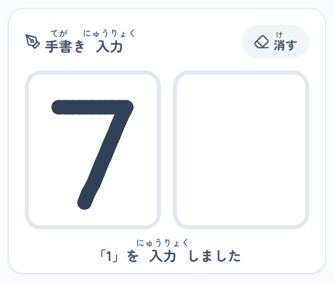

<ruby>書<rt>か</rt></ruby>いただけでは、まだ 入りません。

<ruby>読<rt>よ</rt></ruby>みとると、わくの 下に 「「7」を <ruby>入力<rt>にゅうりょく</rt></ruby>しました」のように 出て、マスに <ruby>数字<rt>すうじ</rt></ruby>が 入ります。
<ruby>書<rt>か</rt></ruby>いた <ruby>線<rt>せん</rt></ruby>は <ruby>消<rt>き</rt></ruby>えるので、つぎの マスを そのまま <ruby>書<rt>か</rt></ruby>けます。

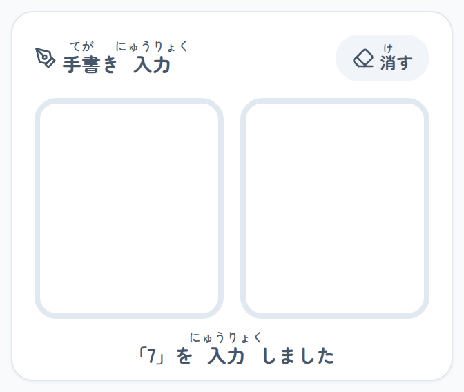

<ruby>線<rt>せん</rt></ruby>が <ruby>消<rt>き</rt></ruby>えて、下に <ruby>読<rt>よ</rt></ruby>みとった <ruby>数<rt>かず</rt></ruby>が 出ます。

### 2けたの <ruby>答<rt>こた</rt></ruby>えは、左と 右に 1つずつ <ruby>書<rt>か</rt></ruby>く

<ruby>答<rt>こた</rt></ruby>えが 2けた（10 から 81）の ときは、左の わくに 十のくらい、右の わくに 一のくらいを <ruby>書<rt>か</rt></ruby>きます。
1けたの ときは、<ruby>左右<rt>さゆう</rt></ruby>の どちらか かた<ruby>方<rt>ほう</rt></ruby>だけに <ruby>書<rt>か</rt></ruby>きます。

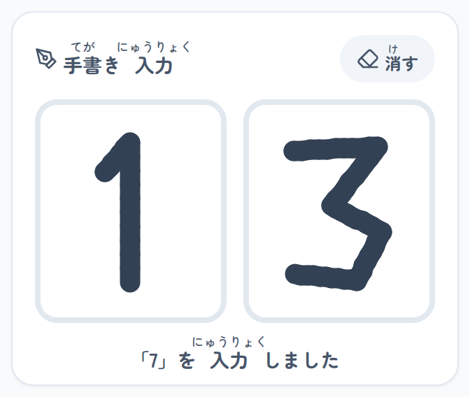

13 なら、左に 1、右に 3 を <ruby>書<rt>か</rt></ruby>きます。

### <ruby>書<rt>か</rt></ruby>きまちがえた ときに <ruby>消<rt>け</rt></ruby>して <ruby>書<rt>か</rt></ruby>き<ruby>直<rt>なお</rt></ruby>す

<ruby>書<rt>か</rt></ruby>きまちがえた ときは、<ruby>右上<rt>みぎうえ</rt></ruby>の 「<ruby>消<rt>け</rt></ruby>す」ボタンを おしてください。<ruby>左右<rt>さゆう</rt></ruby>の わくが <ruby>両方<rt>りょうほう</rt></ruby> <ruby>消<rt>き</rt></ruby>えます。

<ruby>読<rt>よ</rt></ruby>みとりが うまく いかなくて、ちがう <ruby>数<rt>かず</rt></ruby>が マスに 入って しまう ことも あります。
「すぐ<ruby>判定<rt>はんてい</rt></ruby>」を 入れて いる ときは、まちがいは その<ruby>場<rt>ば</rt></ruby>で <ruby>消<rt>き</rt></ruby>えるので、もう<ruby>一度<rt>いちど</rt></ruby> 大きく <ruby>書<rt>か</rt></ruby>いてください。
「すぐ<ruby>判定<rt>はんてい</rt></ruby>」を <ruby>切<rt>き</rt></ruby>って いる ときは、ボタン<ruby>入力<rt>にゅうりょく</rt></ruby>の 「<ruby>消<rt>け</rt></ruby>す」か キーボードの BackSpace で 1<ruby>文字<rt>もじ</rt></ruby>ずつ <ruby>消<rt>け</rt></ruby>してから <ruby>書<rt>か</rt></ruby>き<ruby>直<rt>なお</rt></ruby>してください。

【！】<ruby>覚<rt>おぼ</rt></ruby>えておいて ほしいこと:

- <ruby>読<rt>よ</rt></ruby>みとりは、<ruby>指<rt>ゆび</rt></ruby>を はなしてから はしります。<ruby>書<rt>か</rt></ruby>いている とちゅうでは うごきません
- マスの 中を おしても、<ruby>機械<rt>きかい</rt></ruby>の キーボードは 出てきません。<ruby>手書<rt>てが</rt></ruby>きの わくが かくれない ようにするためです
- うまく <ruby>読<rt>よ</rt></ruby>まれない ときは、わくいっぱいに 大きく、ふとく <ruby>書<rt>か</rt></ruby>いてください

## <ruby>答<rt>こた</rt></ruby>えを ボタンや キーボードで 入れる

<ruby>手書<rt>てが</rt></ruby>きが むずかしい ときや、はやさを きそう ときは、こちらが つかいやすいです。

### ボタン（テンキー）で 入れる

ボタン<ruby>入力<rt>にゅうりょく</rt></ruby>は、<ruby>設定<rt>せってい</rt></ruby>の 「ボタン<ruby>入力<rt>にゅうりょく</rt></ruby>を<ruby>使<rt>つか</rt></ruby>う」を 入れると 出てきます。
出しかたは 「<ruby>設定<rt>せってい</rt></ruby>で つかいごこちを かえる」の <ruby>章<rt>しょう</rt></ruby>に <ruby>書<rt>か</rt></ruby>いてあります。

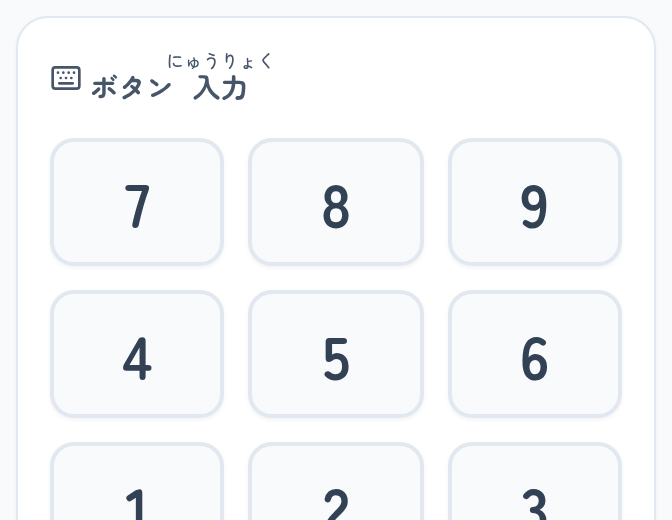

0から9 と、「<ruby>消<rt>け</rt></ruby>す」「<ruby>次<rt>つぎ</rt></ruby>へ」が あります。

- 0から9 の ボタン。おすと、いま えらんでいる マスに 入ります
- <ruby>消<rt>け</rt></ruby>す。さいごの 1<ruby>文字<rt>もじ</rt></ruby>を <ruby>消<rt>け</rt></ruby>します
- <ruby>次<rt>つぎ</rt></ruby>へ。つぎの マスへ すすみます

### キーボードで 入れる

Chromebook や パソコンでは、キーボードでも 入れられます。
<ruby>手書<rt>てが</rt></ruby>きや ボタンを つかう <ruby>設定<rt>せってい</rt></ruby>でも、キーボードは いっしょに つかえます。

- <ruby>数字<rt>すうじ</rt></ruby>の キー。その <ruby>数字<rt>すうじ</rt></ruby>が 入ります
- BackSpace。さいごの 1<ruby>文字<rt>もじ</rt></ruby>を <ruby>消<rt>け</rt></ruby>します
- Enter と 右やじるし。つぎの マスへ すすみます
- 左やじるし・上やじるし・下やじるし。すきな マスへ うごけます

### <ruby>合<rt>あ</rt></ruby>っていた とき・まちがえた ときに おきる こと

はじめの <ruby>設定<rt>せってい</rt></ruby>（すぐ<ruby>判定<rt>はんてい</rt></ruby>）では、<ruby>答<rt>こた</rt></ruby>えを 入れた その ときに <ruby>丸<rt>まる</rt></ruby>つけを します。

- <ruby>合<rt>あ</rt></ruby>っていた とき。音が <ruby>鳴<rt>な</rt></ruby>って、みどりの ふとい わくが つき、つぎの マスへ すすみます
- まちがえた とき。音が <ruby>鳴<rt>な</rt></ruby>って、入れた <ruby>数<rt>かず</rt></ruby>が <ruby>消<rt>き</rt></ruby>えます。もう<ruby>一度<rt>いちど</rt></ruby> 入れてください

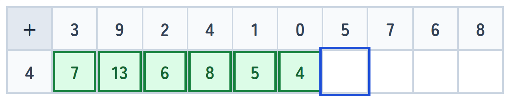

<ruby>合<rt>あ</rt></ruby>った マスは みどりの わくに なります。

【！】<ruby>覚<rt>おぼ</rt></ruby>えておいて ほしいこと:

- <ruby>合<rt>あ</rt></ruby>うまで つぎに すすめないので、さいごまで やると ぜんぶ <ruby>正解<rt>せいかい</rt></ruby>に なります
- まちがえた ことは、<ruby>記録<rt>きろく</rt></ruby>の 中に のこります。あとで 見られます
- まちがいを のこしたまま すすめたい ときは、<ruby>設定<rt>せってい</rt></ruby>の 「すぐ<ruby>判定<rt>はんてい</rt></ruby>」を <ruby>切<rt>き</rt></ruby>ってください

## とちゅうで やめる・おわったら <ruby>結果<rt>けっか</rt></ruby>を 見る

さいごまで できた ときも、とちゅうで やめた ときも、<ruby>記録<rt>きろく</rt></ruby>は のこります。

### とちゅうで やめる

1. 上の バーの 「やめる」を おしてください。
2. たしかめる まどが 出ます。

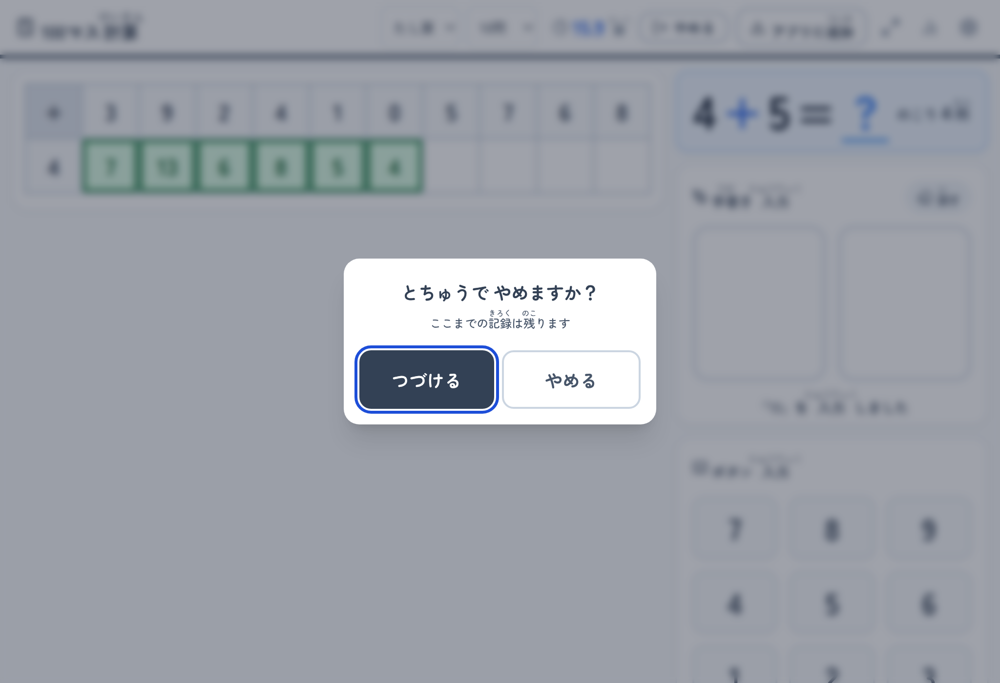

「つづける」か「やめる」を えらびます。

3. やめる ときは 「やめる」を、つづける ときは 「つづける」を おしてください。

【！】<ruby>覚<rt>おぼ</rt></ruby>えておいて ほしいこと:

- とちゅうで やめても、そこまでの <ruby>記録<rt>きろく</rt></ruby>は のこります
- 「とちゅうでやめた<ruby>回数<rt>かいすう</rt></ruby>」として <ruby>記録<rt>きろく</rt></ruby>に 出ます。むずかしすぎた しるしなので、はずかしい ことでは ありません
- ほかの <ruby>画面<rt>がめん</rt></ruby>を 見たまま 5<ruby>分<rt>ぷん</rt></ruby> もどらなかった ときも、とちゅうで やめた ことに なります

### ぜんぶ できた ときの <ruby>結果<rt>けっか</rt></ruby>

とりくみが おわると、<ruby>時間<rt>じかん</rt></ruby>が <ruby>止<rt>と</rt></ruby>まって、上に <ruby>結果<rt>けっか</rt></ruby>が 出ます。

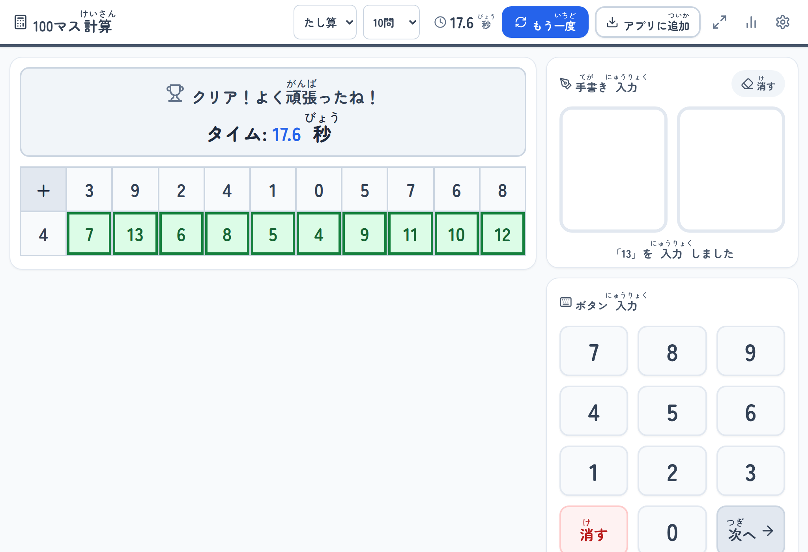

かかった <ruby>時間<rt>じかん</rt></ruby>が 大きく 出ます。

- ぜんぶ <ruby>正解<rt>せいかい</rt></ruby>の とき。「クリア！よく<ruby>頑張<rt>がんば</rt></ruby>ったね！」と 出ます
- <ruby>正解<rt>せいかい</rt></ruby>できなかった マスが ある とき。「おわり！<ruby>正解<rt>せいかい</rt></ruby> <ruby>何問<rt>なんもん</rt></ruby>」と 出ます

### もう<ruby>一度<rt>いちど</rt></ruby> やる（あたらしい ならびで やり<ruby>直<rt>なお</rt></ruby>す）

<ruby>結果<rt>けっか</rt></ruby>が 出ると、上の バーの ボタンが 「もう<ruby>一度<rt>いちど</rt></ruby>」に かわります。
おすと、あたらしい ならびの ひょうが 出て、はじめから やり<ruby>直<rt>なお</rt></ruby>せます。

<ruby>計算<rt>けいさん</rt></ruby>の しゅるいや もんだいの <ruby>数<rt>かず</rt></ruby>を かえたい ときも、「もう<ruby>一度<rt>いちど</rt></ruby>」を おしてから えらんでください。

## <ruby>設定<rt>せってい</rt></ruby>で つかいごこちを かえる（音・<ruby>入力<rt>にゅうりょく</rt></ruby>・<ruby>丸<rt>まる</rt></ruby>つけ）

<ruby>設定<rt>せってい</rt></ruby>は この <ruby>機械<rt>きかい</rt></ruby>の 中に のこります。つぎに ひらいた ときも、<ruby>前<rt>まえ</rt></ruby>の ままです。

### <ruby>設定<rt>せってい</rt></ruby>の <ruby>画面<rt>がめん</rt></ruby>を ひらく

1. 上の バーの 右はしに ある はぐるまの しるしを おしてください。
2. <ruby>設定<rt>せってい</rt></ruby>の まどが 出ます。

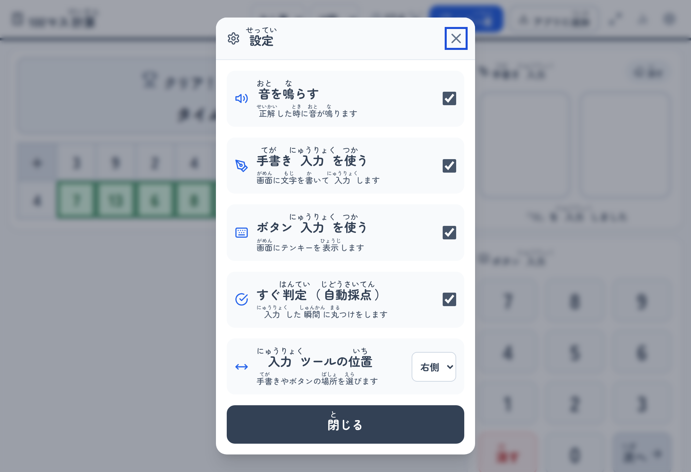

5つの ことを かえられます。

3. かえおわったら、下の 「<ruby>閉<rt>と</rt></ruby>じる」を おしてください。

### 音を <ruby>鳴<rt>な</rt></ruby>らす／音を <ruby>消<rt>け</rt></ruby>す

「音を<ruby>鳴<rt>な</rt></ruby>らす」を 入れると、<ruby>正解<rt>せいかい</rt></ruby>した とき、まちがえた とき、おわった ときに 音が <ruby>鳴<rt>な</rt></ruby>ります。
<ruby>切<rt>き</rt></ruby>ると、音は <ruby>鳴<rt>な</rt></ruby>りません。

音に びっくりしてしまう 人が いる ときや、みんなで しずかに とりくむ ときは、<ruby>切<rt>き</rt></ruby>ってください。

### <ruby>手書<rt>てが</rt></ruby>き<ruby>入力<rt>にゅうりょく</rt></ruby>・ボタン<ruby>入力<rt>にゅうりょく</rt></ruby>を つかうか きめる

「<ruby>手書<rt>てが</rt></ruby>き<ruby>入力<rt>にゅうりょく</rt></ruby>を<ruby>使<rt>つか</rt></ruby>う」と「ボタン<ruby>入力<rt>にゅうりょく</rt></ruby>を<ruby>使<rt>つか</rt></ruby>う」は、どちらも 入れたり <ruby>切<rt>き</rt></ruby>ったり できます。
<ruby>両方<rt>りょうほう</rt></ruby> 入れると、<ruby>手書<rt>てが</rt></ruby>きの わくと ボタンが <ruby>両方<rt>りょうほう</rt></ruby> 出ます。

<ruby>手書<rt>てが</rt></ruby>きを つかわない ときは <ruby>切<rt>き</rt></ruby>ってください。<ruby>読<rt>よ</rt></ruby>みとりの <ruby>部品<rt>ぶひん</rt></ruby>も <ruby>取<rt>と</rt></ruby>りにいかなくなります。

<ruby>両方<rt>りょうほう</rt></ruby> <ruby>切<rt>き</rt></ruby>ると、マスを おした ときに <ruby>機械<rt>きかい</rt></ruby>の キーボードが 出るように なります。

### <ruby>入力<rt>にゅうりょく</rt></ruby>どうぐを 右か 左に おく

「<ruby>入力<rt>にゅうりょく</rt></ruby>ツールの<ruby>位置<rt>いち</rt></ruby>」で、<ruby>手書<rt>てが</rt></ruby>きや ボタンを <ruby>画面<rt>がめん</rt></ruby>の 右に おくか 左に おくかを えらべます。

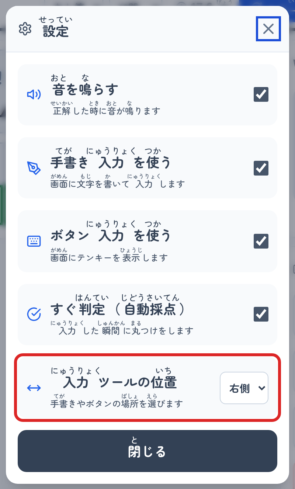

赤い わくの ところで えらびます。

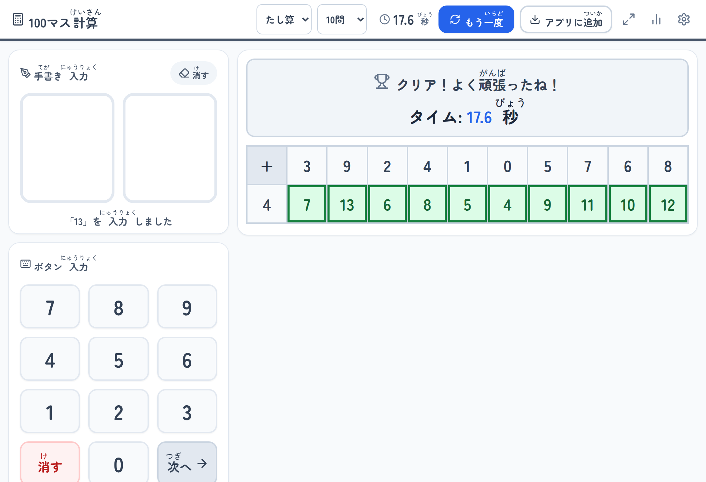

左ききの 人は、こちらが <ruby>書<rt>か</rt></ruby>きやすいです。

### すぐ<ruby>判定<rt>はんてい</rt></ruby>（<ruby>自動採点<rt>じどうさいてん</rt></ruby>）を <ruby>切<rt>き</rt></ruby>って、あとで まとめて <ruby>丸<rt>まる</rt></ruby>つけする

「すぐ<ruby>判定<rt>はんてい</rt></ruby>」を 入れて いる ときは、<ruby>答<rt>こた</rt></ruby>えを 入れた その ときに <ruby>丸<rt>まる</rt></ruby>つけを します。
<ruby>切<rt>き</rt></ruby>ると、<ruby>紙<rt>かみ</rt></ruby>の テストと <ruby>同<rt>おな</rt></ruby>じように、さいごまで <ruby>自分<rt>じぶん</rt></ruby>で といてから <ruby>答<rt>こた</rt></ruby>え<ruby>合<rt>あ</rt></ruby>わせを する ことに なります。

<ruby>切<rt>き</rt></ruby>ったときに かわる ことは、つぎの とおりです。

- まちがえても 入れた <ruby>数<rt>かず</rt></ruby>は <ruby>消<rt>き</rt></ruby>えません。そのまま のこります
- とちゅうでは みどりや 赤の しるしが つきません
- 「のこり <ruby>何問<rt>なんもん</rt></ruby>」は、まだ 入れていない マスの <ruby>数<rt>かず</rt></ruby>に なります
- Enter か 右やじるし か 「<ruby>次<rt>つぎ</rt></ruby>へ」で、<ruby>自分<rt>じぶん</rt></ruby>で つぎの マスへ すすみます
- ぜんぶの マスが うまった ときに おわって、まとめて <ruby>丸<rt>まる</rt></ruby>つけを します

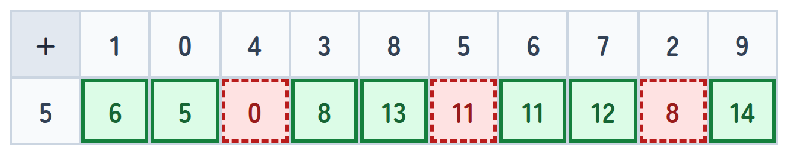

<ruby>正解<rt>せいかい</rt></ruby>は <ruby>実線<rt>じっせん</rt></ruby>の わく、まちがいは <ruby>点線<rt>てんせん</rt></ruby>の わくです。

【！】<ruby>覚<rt>おぼ</rt></ruby>えておいて ほしいこと:

- <ruby>丸<rt>まる</rt></ruby>つけは、ぜんぶの マスが うまってから 出ます
- <ruby>色<rt>いろ</rt></ruby>が <ruby>見分<rt>みわ</rt></ruby>けにくい 人にも <ruby>分<rt>わ</rt></ruby>かるように、わくの <ruby>線<rt>せん</rt></ruby>の かたちでも <ruby>分<rt>わ</rt></ruby>けています
- まちがいを のこしたまま おわった <ruby>回<rt>かい</rt></ruby>は、ベストタイムにも 「<ruby>最近<rt>さいきん</rt></ruby>の<ruby>記録<rt>きろく</rt></ruby>」にも 出ません。ぜんぶ <ruby>正解<rt>せいかい</rt></ruby>で おわれば 出ます

## これまでの <ruby>記録<rt>きろく</rt></ruby>を 見る

<ruby>記録<rt>きろく</rt></ruby>は、とりくむ たびに ふえていきます。

### <ruby>記録<rt>きろく</rt></ruby>の <ruby>画面<rt>がめん</rt></ruby>を ひらく

1. 上の バーの ぼうグラフの しるしを おしてください。
2. <ruby>記録<rt>きろく</rt></ruby>の まどが 出ます。

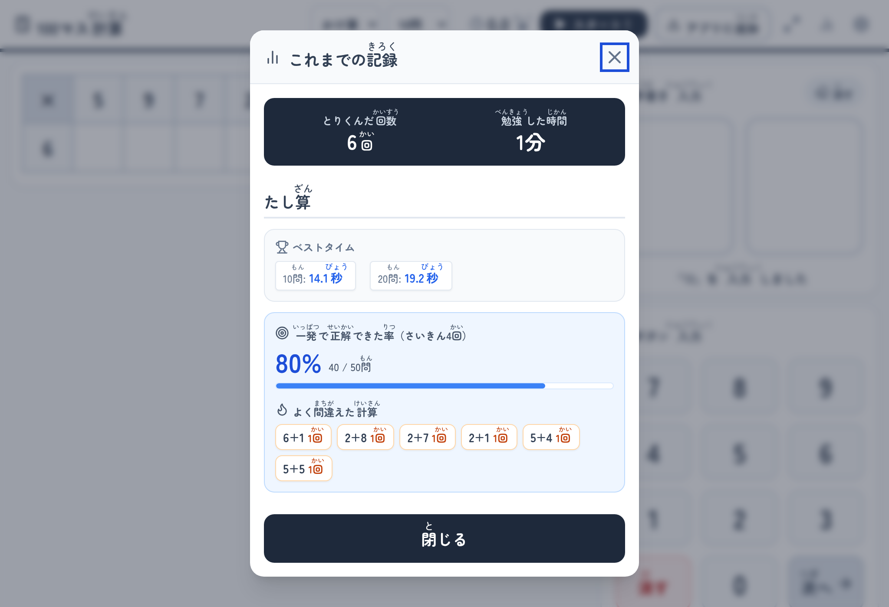

上に ぜんたい、下に <ruby>計算<rt>けいさん</rt></ruby>ごとの <ruby>記録<rt>きろく</rt></ruby>が 出ます。

3. 見おわったら、下の 「<ruby>閉<rt>と</rt></ruby>じる」を おしてください。

### とりくんだ <ruby>回数<rt>かいすう</rt></ruby>と、<ruby>勉強<rt>べんきょう</rt></ruby>した <ruby>時間<rt>じかん</rt></ruby>

いちばん 上の くろい ところに、3つの <ruby>計算<rt>けいさん</rt></ruby>を あわせた 「とりくんだ<ruby>回数<rt>かいすう</rt></ruby>」と 「<ruby>勉強<rt>べんきょう</rt></ruby>した<ruby>時間<rt>じかん</rt></ruby>」が 出ます。

「<ruby>勉強<rt>べんきょう</rt></ruby>した<ruby>時間<rt>じかん</rt></ruby>」は、1<ruby>分<rt>ぷん</rt></ruby>ほど <ruby>何<rt>なに</rt></ruby>も していないと <ruby>数<rt>かぞ</rt></ruby>えるのを <ruby>止<rt>と</rt></ruby>めます。
ほかの <ruby>画面<rt>がめん</rt></ruby>を 見ている あいだも <ruby>数<rt>かぞ</rt></ruby>えません。ひらいたままに していた <ruby>時間<rt>じかん</rt></ruby>は 入りません。

### ベストタイムと <ruby>最近<rt>さいきん</rt></ruby>の <ruby>記録<rt>きろく</rt></ruby>

ベストタイムは、その <ruby>計算<rt>けいさん</rt></ruby>の いちばん はやかった <ruby>時間<rt>じかん</rt></ruby>です。
もんだいの <ruby>数<rt>かず</rt></ruby>ごとに 出るので、10<ruby>問<rt>もん</rt></ruby>と 100<ruby>問<rt>もん</rt></ruby>は べつに ならびます。

「<ruby>最近<rt>さいきん</rt></ruby>の<ruby>記録<rt>きろく</rt></ruby>」には、あたらしい ほうから 20<ruby>回<rt>かい</rt></ruby>ぶんが ならびます。

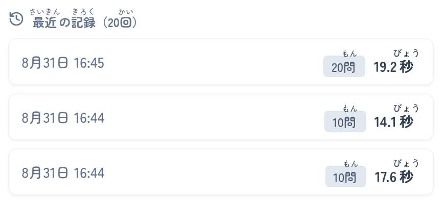

日づけと、もんだいの <ruby>数<rt>かず</rt></ruby>と、<ruby>時間<rt>じかん</rt></ruby>が 出ます。

ベストタイムと <ruby>最近<rt>さいきん</rt></ruby>の <ruby>記録<rt>きろく</rt></ruby>に 出るのは、ぜんぶ <ruby>正解<rt>せいかい</rt></ruby>で おわった <ruby>回<rt>かい</rt></ruby>だけです。
とちゅうで やめた <ruby>回<rt>かい</rt></ruby>や、まちがいを のこしたまま おわった <ruby>回<rt>かい</rt></ruby>は ここには 出ません。

### <ruby>一発<rt>いっぱつ</rt></ruby>で <ruby>正解<rt>せいかい</rt></ruby>できた <ruby>率<rt>りつ</rt></ruby>と、よく まちがえた <ruby>計算<rt>けいさん</rt></ruby>

青い ところには、力が のびているかどうかが <ruby>分<rt>わ</rt></ruby>かる <ruby>数字<rt>すうじ</rt></ruby>が 出ます。

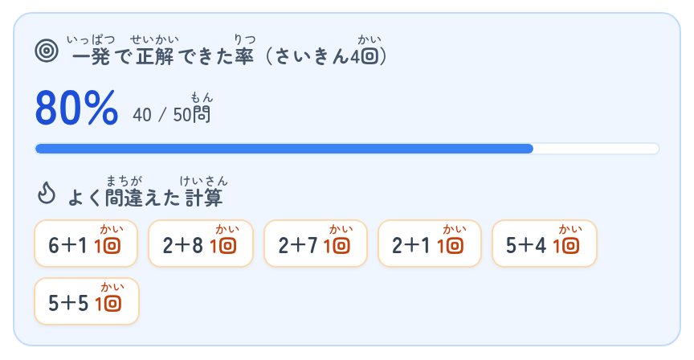

さいきん 10<ruby>回<rt>かい</rt></ruby>ぶんから 出します。

「<ruby>一発<rt>いっぱつ</rt></ruby>で<ruby>正解<rt>せいかい</rt></ruby>できた<ruby>率<rt>りつ</rt></ruby>」は、1<ruby>回目<rt>かいめ</rt></ruby>の <ruby>答<rt>こた</rt></ruby>えで <ruby>合<rt>あ</rt></ruby>っていた わりあいです。
「すぐ<ruby>判定<rt>はんてい</rt></ruby>」を 入れて いる ときは <ruby>合<rt>あ</rt></ruby>うまで つぎに すすめないので、<ruby>正解<rt>せいかい</rt></ruby>の <ruby>数<rt>かず</rt></ruby>は いつも <ruby>満点<rt>まんてん</rt></ruby>に なります。
のびているかどうかは、こちらの <ruby>数字<rt>すうじ</rt></ruby>で <ruby>分<rt>わ</rt></ruby>かります。

その 下の 「よく<ruby>間違<rt>まちが</rt></ruby>えた<ruby>計算<rt>けいさん</rt></ruby>」には、<ruby>何度<rt>なんど</rt></ruby>も まちがえた <ruby>式<rt>しき</rt></ruby>が <ruby>多<rt>おお</rt></ruby>い じゅんに 6つまで ならびます。
ここに 出た <ruby>式<rt>しき</rt></ruby>を もう<ruby>一度<rt>いちど</rt></ruby> やってみると、つぎは はやく なります。

とちゅうで やめた <ruby>回<rt>かい</rt></ruby>が ある ときは、「とちゅうでやめた<ruby>回数<rt>かいすう</rt></ruby>」も 出ます。

### 【！】<ruby>記録<rt>きろく</rt></ruby>が のこる ばしょ

<ruby>記録<rt>きろく</rt></ruby>は、いま つかっている <ruby>機械<rt>きかい</rt></ruby>の 中だけに のこります。
<ruby>名前<rt>なまえ</rt></ruby>・<ruby>出席番号<rt>しゅっせきばんごう</rt></ruby>・メールアドレスは <ruby>記録<rt>きろく</rt></ruby>して いません。

【！】<ruby>覚<rt>おぼ</rt></ruby>えておいて ほしいこと:

- <ruby>記録<rt>きろく</rt></ruby>は <ruby>機械<rt>きかい</rt></ruby>ごとです。おなじ <ruby>機械<rt>きかい</rt></ruby>を <ruby>何人<rt>なんにん</rt></ruby>かで つかうと、<ruby>記録<rt>きろく</rt></ruby>は 1つに まざります
- 先生が <ruby>学級<rt>がっきゅう</rt></ruby>ぜんいんの <ruby>記録<rt>きろく</rt></ruby>を <ruby>一覧<rt>いちらん</rt></ruby>で 見る <ruby>画面<rt>がめん</rt></ruby>は ありません
- アプリの 中に、<ruby>記録<rt>きろく</rt></ruby>を <ruby>消<rt>け</rt></ruby>す ボタンは ありません。<ruby>消<rt>け</rt></ruby>したい ときは、ブラウザの 「<ruby>閲覧<rt>えつらん</rt></ruby>データの<ruby>削除<rt>さくじょ</rt></ruby>」を つかってください
- iPad で 7日 つかわないと、<ruby>記録<rt>きろく</rt></ruby>が <ruby>消<rt>き</rt></ruby>える ことが あります

## <ruby>紙<rt>かみ</rt></ruby>に <ruby>印刷<rt>いんさつ</rt></ruby>して つかう（先生むけ）

ここは 先生が <ruby>読<rt>よ</rt></ruby>む ところです。ふだん つかう ときは、この <ruby>章<rt>しょう</rt></ruby>を <ruby>読<rt>よ</rt></ruby>まなくても だいじょうぶです。

### 白い マスの ひょうを <ruby>刷<rt>す</rt></ruby>る

ブラウザの メニューから 「<ruby>印刷<rt>いんさつ</rt></ruby>」を えらぶと、マスの ひょうだけが <ruby>紙<rt>かみ</rt></ruby>に 出ます。
上の バーも、<ruby>手書<rt>てが</rt></ruby>きの わくも、ボタンも <ruby>紙<rt>かみ</rt></ruby>には 出ません。

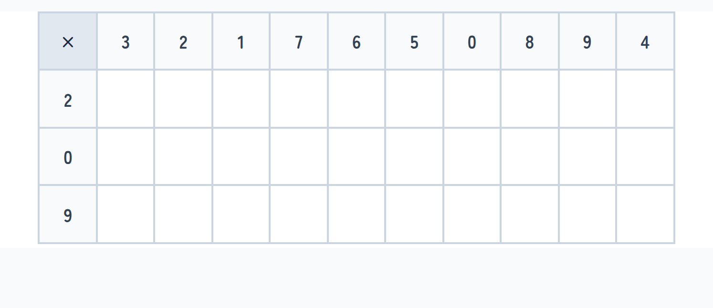

ひょうだけが 出ます。

<ruby>刷<rt>す</rt></ruby>る <ruby>手順<rt>てじゅん</rt></ruby>:

1. もんだいの <ruby>数<rt>かず</rt></ruby>を えらんでください。
2. 「スタート！」を おす まえに、ブラウザの メニューから 「<ruby>印刷<rt>いんさつ</rt></ruby>」を えらんでください。
3. プレビューで、ひょうが 1ページに 入っているかを 見てください。

「スタート！」を おす まえに <ruby>刷<rt>す</rt></ruby>ると、白い プリントとして くばれます。

### <ruby>刷<rt>す</rt></ruby>る まえに たしかめる こと

- <ruby>用紙<rt>ようし</rt></ruby>は A4 の たてむきです
- 1つの マスは 16ミリメートル <ruby>角<rt>かく</rt></ruby>です。100<ruby>問<rt>もん</rt></ruby>（10<ruby>行<rt>ぎょう</rt></ruby>）でも 1ページに 入ります
- とちゅうまで <ruby>答<rt>こた</rt></ruby>えを 入れてから <ruby>刷<rt>す</rt></ruby>ると、入れた <ruby>数<rt>かず</rt></ruby>も、みどりの しるしも いっしょに 出ます

## <ruby>電子黒板<rt>でんしこくばん</rt></ruby>に 大きく うつす（<ruby>提示<rt>ていじ</rt></ruby>モード・先生むけ）

ここも 先生が <ruby>読<rt>よ</rt></ruby>む ところです。ふだん つかう ときは <ruby>読<rt>よ</rt></ruby>まなくても だいじょうぶです。

上の バーの 「大きく<ruby>表示<rt>ひょうじ</rt></ruby>する」を おすと、<ruby>提示<rt>ていじ</rt></ruby>モードに なります。
字も マスも 大きくなり、<ruby>画面<rt>がめん</rt></ruby>ぜんたいに <ruby>広<rt>ひろ</rt></ruby>がります。

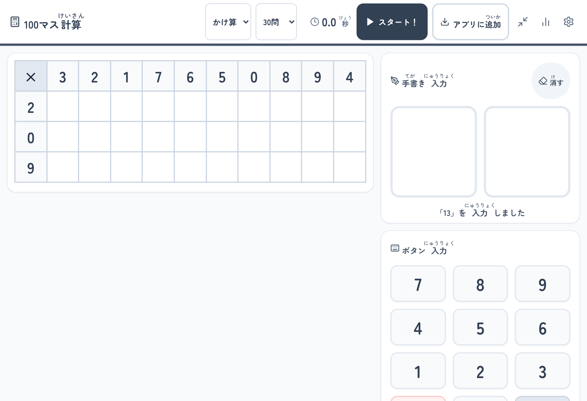

ふだんの <ruby>画面<rt>がめん</rt></ruby>より 字が 大きく なります。

<ruby>提示<rt>ていじ</rt></ruby>モードで できる ことは、つぎの とおりです。

- 65インチから 75インチの <ruby>電子黒板<rt>でんしこくばん</rt></ruby>で、<ruby>教室<rt>きょうしつ</rt></ruby>の いちばん うしろの せきからも マスの <ruby>数字<rt>すうじ</rt></ruby>が <ruby>読<rt>よ</rt></ruby>めます
- もう<ruby>一度<rt>いちど</rt></ruby> おすか、Esc キーで もとに もどります
- キーボードだけでも つかえます。Tab で うつって Enter で えらびます
- スマートフォンや タブレットを たてむきで つかっている ときは、<ruby>手書<rt>てが</rt></ruby>きと ボタンが <ruby>画面<rt>がめん</rt></ruby>の はばいっぱいの まま 大きく なります
- iPad の Safari は <ruby>画面<rt>がめん</rt></ruby>ぜんたいに <ruby>広<rt>ひろ</rt></ruby>げる しくみに <ruby>対応<rt>たいおう</rt></ruby>していないので、字と マスが 大きく なる ところまでが はたらきます

つかいかたの <ruby>例<rt>れい</rt></ruby>を あげます。

- <ruby>今日<rt>きょう</rt></ruby> やる ところを うつしながら、みんなで いっしょに はじめる
- <ruby>手元<rt>てもと</rt></ruby>の <ruby>機械<rt>きかい</rt></ruby>で といてもらいながら、<ruby>黒板<rt>こくばん</rt></ruby>がわには 「いま <ruby>何問目<rt>なんもんめ</rt></ruby>か」を うつしておく
- <ruby>答<rt>こた</rt></ruby>え<ruby>合<rt>あ</rt></ruby>わせの とき、<ruby>正解<rt>せいかい</rt></ruby>の マスと まちがいの マスを みんなで 見る

この アプリは <ruby>名前<rt>なまえ</rt></ruby>も <ruby>出席番号<rt>しゅっせきばんごう</rt></ruby>も あつかっていないので、<ruby>提示<rt>ていじ</rt></ruby>モードで かくす ものは ありません。

## うまく いかない ときは

こまった ときは、ここを 上から さがしてください。

### 「あたらしい ばんが あります」と 出た とき

<ruby>画面<rt>がめん</rt></ruby>の 下に くろい おびで 出ます。おすまで <ruby>切<rt>き</rt></ruby>りかわりません。

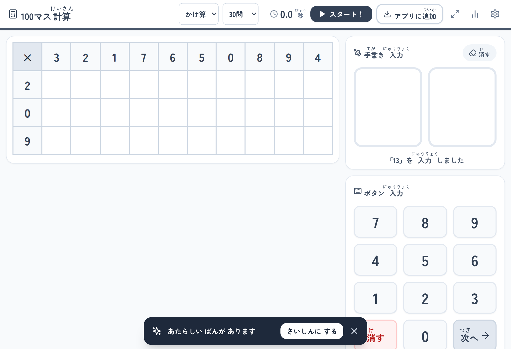

「さいしんに する」を おすと 入れかわります。

<ruby>計算<rt>けいさん</rt></ruby>の とちゅうで おしても だいじょうぶですが、おすと <ruby>画面<rt>がめん</rt></ruby>が <ruby>読<rt>よ</rt></ruby>みこみ<ruby>直<rt>なお</rt></ruby>されます。
とりくみが おわってから おしてください。

右の ✕ で <ruby>閉<rt>と</rt></ruby>じる ことも できますが、つぎに ひらいた ときに また 出ます。

### <ruby>手書<rt>てが</rt></ruby>きの <ruby>数字<rt>すうじ</rt></ruby>が うまく <ruby>読<rt>よ</rt></ruby>まれない とき

わくいっぱいに、大きく ふとく <ruby>書<rt>か</rt></ruby>いてください。小さく <ruby>書<rt>か</rt></ruby>くと <ruby>読<rt>よ</rt></ruby>みとりにくく なります。

2けたの <ruby>答<rt>こた</rt></ruby>えは、左と 右の わくに 1つずつ <ruby>書<rt>か</rt></ruby>きます。1つの わくに 2つ <ruby>書<rt>か</rt></ruby>くと <ruby>読<rt>よ</rt></ruby>めません。

<ruby>読<rt>よ</rt></ruby>めなかった ときは 「<ruby>数字<rt>すうじ</rt></ruby>がわかりませんでした」と 出て、<ruby>書<rt>か</rt></ruby>いた <ruby>線<rt>せん</rt></ruby>が <ruby>消<rt>き</rt></ruby>えます。そのまま <ruby>書<rt>か</rt></ruby>き<ruby>直<rt>なお</rt></ruby>してください。

### 「AIの じゅんびに <ruby>失敗<rt>しっぱい</rt></ruby>しました」と 出た とき

<ruby>手書<rt>てが</rt></ruby>きの <ruby>読<rt>よ</rt></ruby>みとりの <ruby>部品<rt>ぶひん</rt></ruby>が <ruby>読<rt>よ</rt></ruby>みこめて いません。

1. <ruby>設定<rt>せってい</rt></ruby>を ひらいて、「<ruby>手書<rt>てが</rt></ruby>き<ruby>入力<rt>にゅうりょく</rt></ruby>を<ruby>使<rt>つか</rt></ruby>う」を <ruby>切<rt>き</rt></ruby>ってください。
2. もう<ruby>一度<rt>いちど</rt></ruby> 入れてください。<ruby>読<rt>よ</rt></ruby>み<ruby>直<rt>なお</rt></ruby>しに いきます。

それでも <ruby>直<rt>なお</rt></ruby>らない ときは、「ボタン<ruby>入力<rt>にゅうりょく</rt></ruby>を<ruby>使<rt>つか</rt></ruby>う」を 入れて ボタンで といてください。<ruby>計算<rt>けいさん</rt></ruby>そのものは そのまま つづけられます。

### 入れても みどりや 赤が つかない とき

<ruby>設定<rt>せってい</rt></ruby>の 「すぐ<ruby>判定<rt>はんてい</rt></ruby>」が <ruby>切<rt>き</rt></ruby>れて います。
この <ruby>切<rt>き</rt></ruby>りかたでは、ぜんぶの マスが うまるまで <ruby>丸<rt>まる</rt></ruby>つけを しません。

すぐ <ruby>丸<rt>まる</rt></ruby>つけを してほしい ときは、<ruby>設定<rt>せってい</rt></ruby>で 「すぐ<ruby>判定<rt>はんてい</rt></ruby>」を 入れてください。

### マスが 小さくて おしにくい とき

マスの 大きさは、<ruby>画面<rt>がめん</rt></ruby>の はばと たかさに あわせて じどうで きまります。

- もんだいの <ruby>数<rt>かず</rt></ruby>を へらすと、<ruby>行<rt>ぎょう</rt></ruby>が へって、マスは 大きく なります
- マスの 大きさは、よこはばと たてはばの せまい ほうで きまります。<ruby>機械<rt>きかい</rt></ruby>を よこむきに すると よこはばは <ruby>広<rt>ひろ</rt></ruby>く なりますが、たてはばは せまく なるので、<ruby>行<rt>ぎょう</rt></ruby>が <ruby>多<rt>おお</rt></ruby>い ときは たてむきの ほうが 大きい ことも あります
- <ruby>手書<rt>てが</rt></ruby>きか ボタンで 入れると、マスを おさなくても <ruby>答<rt>こた</rt></ruby>えを 入れられます

### 字の <ruby>形<rt>かたち</rt></ruby>が いつもと ちがう とき

この アプリの <ruby>書体<rt>しょたい</rt></ruby>は アプリの 中に 入れて あるので、インターネットに つながっていなくても <ruby>当<rt>あ</rt></ruby>たります。
ただし、つぎの 2つの ときは、<ruby>機械<rt>きかい</rt></ruby>の 中に ある べつの <ruby>書体<rt>しょたい</rt></ruby>で 出ます。どちらも うごきに もんだいは ありません。

- はじめて ひらいて、<ruby>書体<rt>しょたい</rt></ruby>を <ruby>読<rt>よ</rt></ruby>みこみおわるまでの <ruby>少<rt>すこ</rt></ruby>しの あいだ
- この <ruby>書体<rt>しょたい</rt></ruby>に 入っていない めずらしい 字を 出す とき

### <ruby>記録<rt>きろく</rt></ruby>が きえて しまった とき

iPad で 7日 いじょう つかっていないと、Safari が <ruby>記録<rt>きろく</rt></ruby>を <ruby>消<rt>け</rt></ruby>す ことが あります。
ホーム<ruby>画面<rt>がめん</rt></ruby>に 入れておくと <ruby>消<rt>き</rt></ruby>えにくく なります。

ブラウザの 「<ruby>閲覧<rt>えつらん</rt></ruby>データの<ruby>削除<rt>さくじょ</rt></ruby>」を した ときも <ruby>消<rt>き</rt></ruby>えます。

### <ruby>画面<rt>がめん</rt></ruby>が まっしろに なった とき

1. いちど タブを <ruby>閉<rt>と</rt></ruby>じて、もう<ruby>一度<rt>いちど</rt></ruby> ひらいてください。
2. <ruby>直<rt>なお</rt></ruby>らない ときは、ブラウザの 「<ruby>再読<rt>さいよ</rt></ruby>み<ruby>込<rt>こ</rt></ruby>み」を <ruby>長<rt>なが</rt></ruby>おしして、「キャッシュの<ruby>消去<rt>しょうきょ</rt></ruby>とハード<ruby>再読<rt>さいよ</rt></ruby>み<ruby>込<rt>こ</rt></ruby>み」を えらんでください。

### それでも なおらない ときは

まず、この アプリを おしえてくれた 先生や、学校の <ruby>情報<rt>じょうほう</rt></ruby>の <ruby>係<rt>かかり</rt></ruby>の 先生に きいてください。
学校の ネットワークの せっていで うごかない ことが あるので、いちばん はやく わかります。

それでも わからない ときは、この ページの 下に ある <ruby>問<rt>と</rt></ruby>い<ruby>合<rt>あ</rt></ruby>わせ先から しらせてください。
