# 教室で使えるかもしれないもの作り #◯ 「40人ぶんの丸つけ、いつやりますか」書いた瞬間に採点される100マス計算アプリ「100マス計算」

## 🏫 はじめに

100マス計算は、やれば力がつくと分かっているものの筆頭ではないでしょうか。朝の会の前の5分、算数のはじめの3分。毎日続けたい、と思って始めた先生は多いと思います。

続かない理由も、たぶん同じところにあります。丸つけです。

40人の学級で100マスを1回やると、赤ペンを入れる数は4000個になります。回収して、放課後に一枚ずつめくって、返すのは翌日。その頃には、子どもはもう自分がどこでつまずいたか覚えていません。まちがえた瞬間に「あ、9たす8だ」と気づくことにこそ意味があるのに、その瞬間から一日ぶん遅れて赤い丸が届きます。

刷る手間もあります。人数ぶんのプリント、答えの用紙、集めて配ってを毎日。だんだん週に3回になり、気がつくと月に1回になっている。私はそうでした。

そこで、タブレットや Chromebook のブラウザで開くだけの100マス計算を作りました。答えを書いた瞬間に丸つけが終わり、時間が測られ、その子がどの計算でつまずいているかまで残ります。先生がやることは「はじめ」と言うことだけです。

https://online-100square-calculation.giga-school.com/

ログインもアカウントもいりません。名前も出席番号も入力しません。上のアドレスを開けば、その場ですぐ始められます。

## 📱 このアプリでできること

開くとこの画面が出ます。上のところで「たし算」「引き算」「かけ算」と、問題数を10問から100問まで選びます。

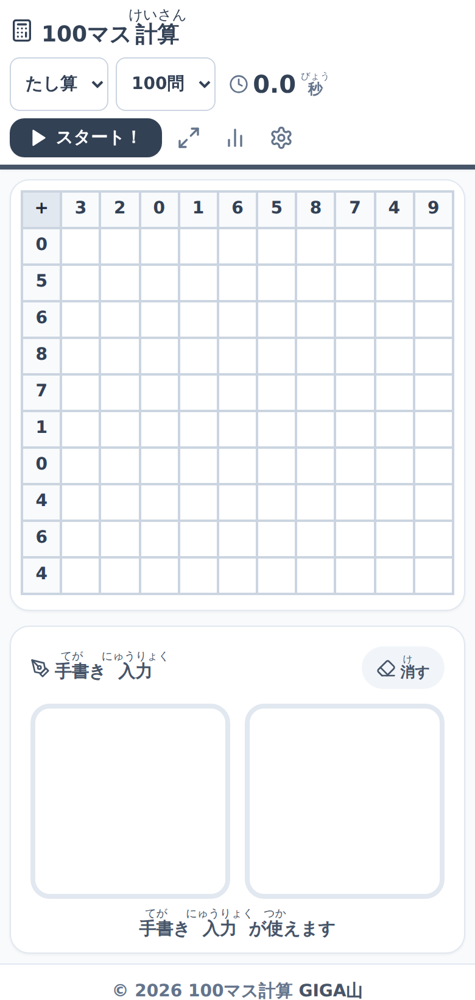

ホーム画面。左に手書き入力の欄、上にマスの表があります。

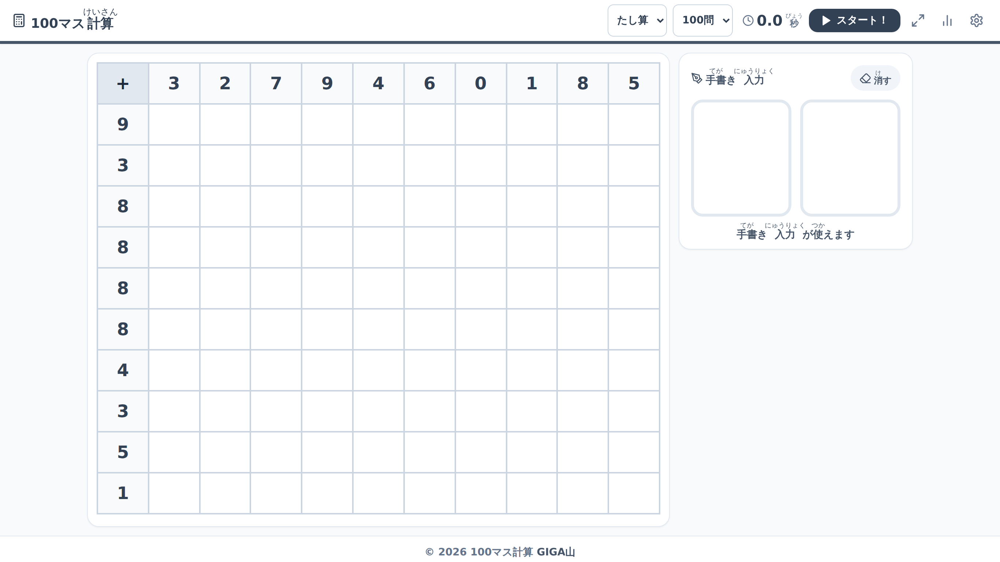

Chromebook の横長の画面では、マスの表と手書きの欄が左右に並びます。

「スタート！」を押すと時間が動きだします。

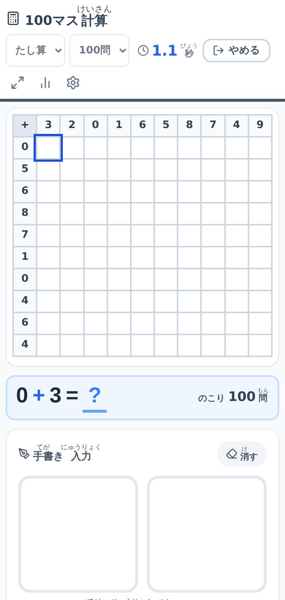

いま解いている計算が、手書きの欄のすぐ上に大きく出ます。のこりの問題数もここに出ます。

この「いま解いている計算を大きく出す」ところは、あとから足したものです。最初に作ったときは、マスの中の数字だけを見て解く形にしていました。ところが100マスのマスは、スマートフォンだと1辺が3センチもありません。低学年の子が指で答えを書きながら「今どこを解いているんだっけ」と迷子になる。視線を上下に往復させずに済むように、手が届く場所へ式を持ってきました。

答えを入れると、正解なら音が鳴って自動で次のマスへ進みます。まちがえると入力が消えて、もう一度になります。

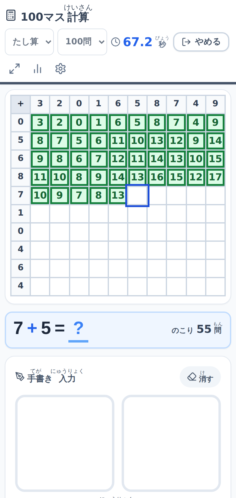

正解したマスは緑になります。押した順に自動で進むので、マスを一つずつタップし直す必要がありません。

正解するまで次に進めない作りにしたのは、100マス計算が「速く正確に」を身につけるものだからです。まちがえたまま先へ行けてしまうと、最後に何点だったかは分かっても、その場で直す機会が消えます。かわりに、後で説明する記録の画面で「1回目で当てられたか」をきちんと残しています。

引き算とかけ算も同じ形です。

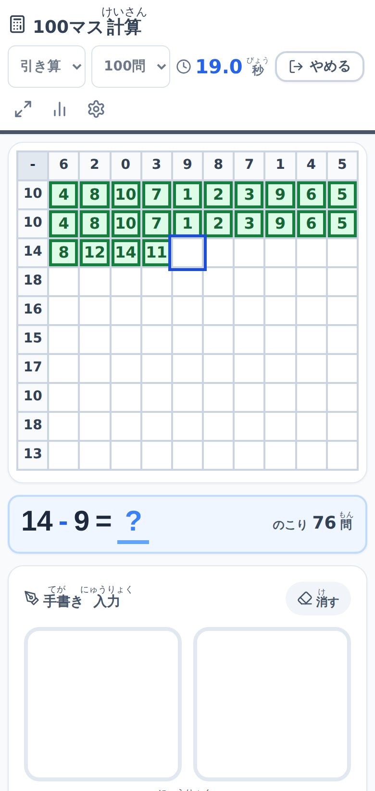

引き算は、10いくつから1桁を引く形になります。くり下がりの練習にそのまま使えます。

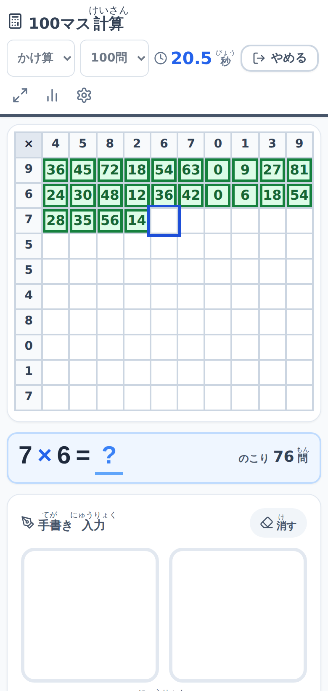

かけ算は九九です。上の行に0から9までが1回ずつ、順番を変えて並びます。

上の行の数字は毎回並べ替えられ、左の列の数字も毎回選び直されます。同じ表が続けて出ることはほぼないので、並びごと覚えてしまうことがありません。

全部のマスが埋まると終わりです。

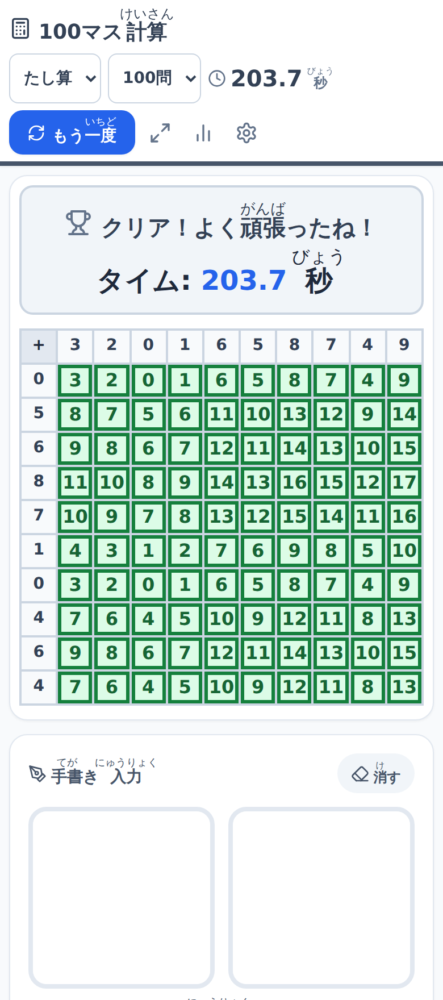

かかった時間が出ます。この画面は100問を実際に解いて撮ったもので、3分23秒かかりました。

すぐに丸をつけない、という使い方もできます。設定で「すぐ判定」を切ると、全部書き終わってからまとめて採点します。

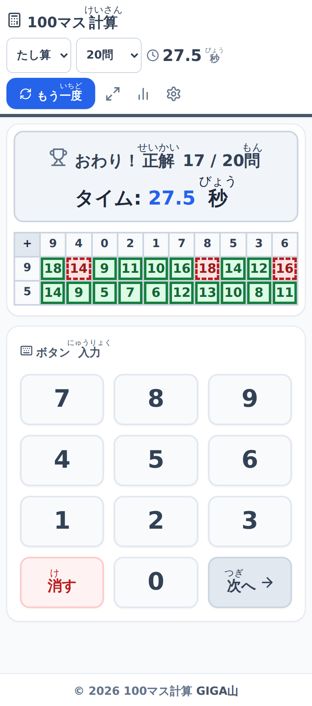

正解は実線の枠、まちがいは破線の枠です。色の見分けがつきにくい子や、画面を白黒の強い表示にしている端末でも、枠の形で区別がつきます。

途中でやめることもできます。

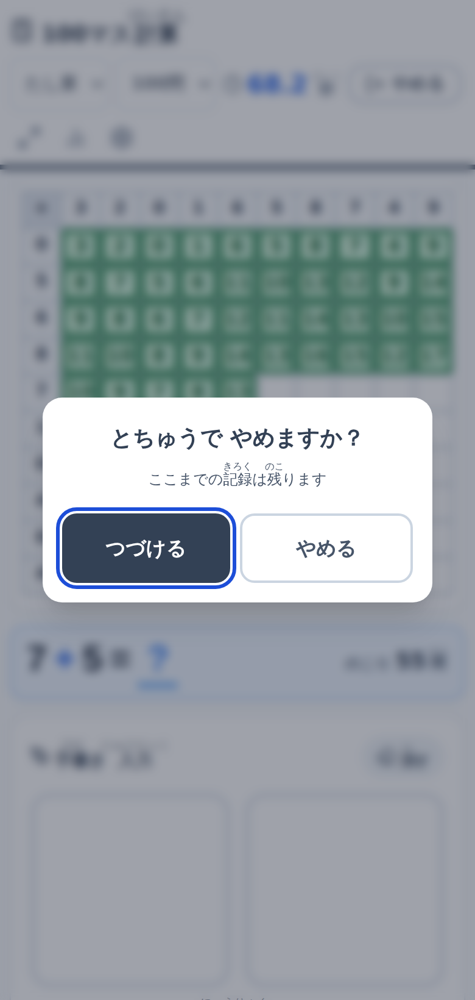

やめてもそこまでの記録は残ります。時間が来たら気にせず切り上げてください。

途中でやめたときだけでなく、端末が勝手に閉じてしまったときも記録は残ります。Chromebook は空きメモリが少なくなるとタブごと消すことがあり、算数の時間に他のアプリを開いていた子の画面が、戻ってきたら白紙に戻っていた、ということが起こります。そこまで解いた15マスが消えるのは、その子にとってかなり悔しいことだと思います。タブが閉じられる直前に記録を確定させて、戻ってきたら残りのマスから続けられるようにしました。

タブを離れたまま5分戻ってこなかったときも、離れた時刻で締めて記録します。5分にしてあるのは、先生の説明を聞くために画面から目を離す数分を「やめた」と数えたくないからです。

## ✍️ 指で数字を書いて答える

このアプリでいちばん時間をかけたのが、ここです。

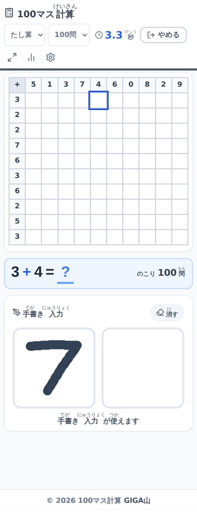

白い枠に指かタッチペンで数字を書きます。枠が2つあるのは、2桁の答えを左右に1文字ずつ書くためです。1桁の答えなら左だけで足ります。

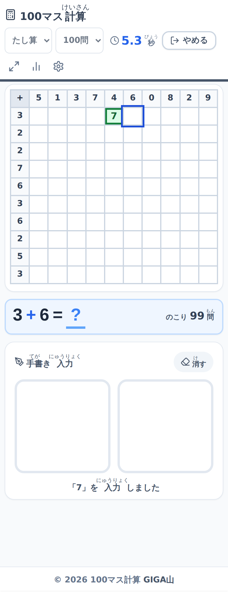

書き終わって指を離すと読み取られ、マスに数字が入ります。この画面では「7」と読み取られて、そのまま正解になりました。

キーボードでもテンキーでもなく手書きから作ったのには理由があります。1年生や2年生は、まだ数字キーの場所を覚えていません。「8はどこ」と探している数秒のあいだに、頭の中で出した答えが消えます。100マス計算は計算そのものに集中してほしいものなので、入力の手間をできるだけ鉛筆に近づけたいと考えました。

読み取りは、その端末の中だけで行われます。書いた線が外のどこかに送られることはありません。インターネットにつながっていない状態でも、同じように読み取れます。

もちろん、手書きが合わない場面もあります。入力の方法は選べます。

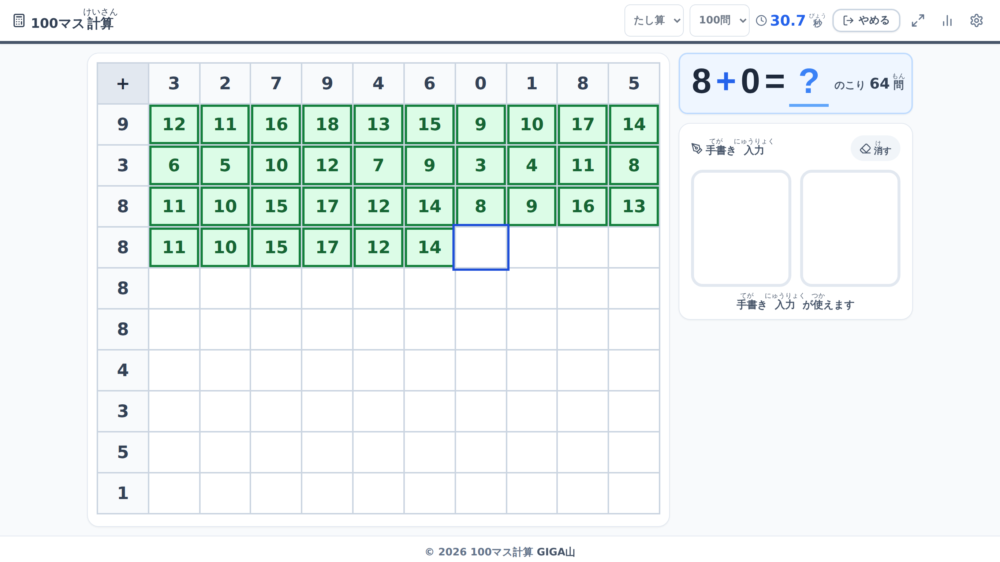

Chromebook のような横長の画面では、マスと手書き欄が左右に並びます。数字キーと Enter、矢印キーでも解けるので、高学年でタイムを競うならキーボードが速いです。

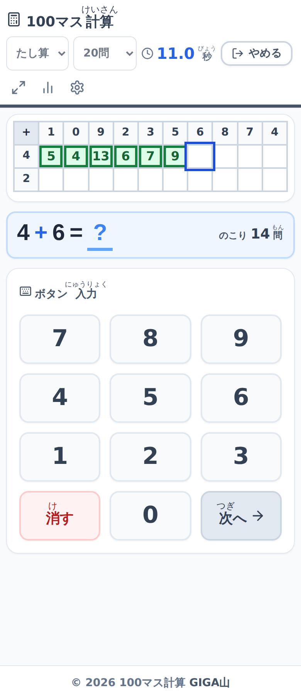

画面に大きなテンキーを出すこともできます。低学年で、押す場所が決まっているほうが安心という子に向いています。

設定はここにまとまっています。

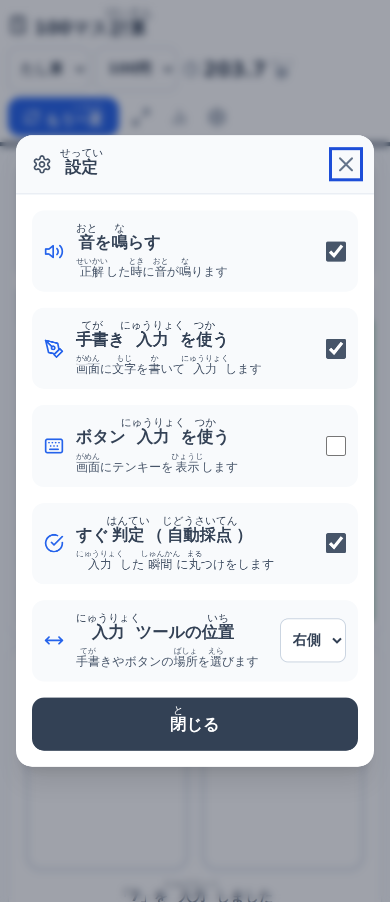

音を鳴らすかどうか、手書きを使うか、ボタンを出すか、すぐ判定をするか、入力ツールを左右どちらに置くか。この5つです。

音を切れるようにしたのは、正解の「ピンポン」が全員にとって気持ちのいい音とはかぎらないからです。感覚が過敏な子がいる学級では、切ってお使いください。

入力ツールの位置を左右で選べるのは、左利きの子のためです。右に手書きの欄があると、書いている手でマスが隠れます。

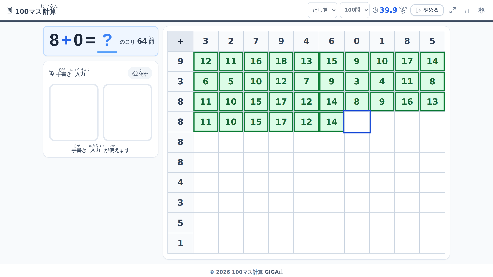

左に置くと、手書きの欄とマスの位置が入れ替わります。

それから、マスを押しても端末のキーボードが出てきません。手書きやボタンで入力しているときに Gboard のような画面キーボードがせり上がってくると、画面の下半分が隠れて手書きの欄が押せなくなります。ここは端末によって挙動が違うので、どの端末でも確実に出ないようにしてあります。物理キーボードからの数字入力は、これまでどおり使えます。

## 📊 タイムより「一発で正解できた率」を見てください

右上の記録のボタンから、これまでの取り組みが見られます。

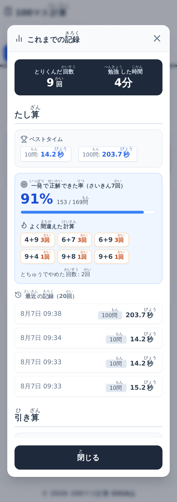

とりくんだ回数、勉強した時間、問題数ごとのベストタイム、そして「一発で正解できた率」が並びます。

「勉強した時間」は、画面を開いていた時間ではなく、実際に手を動かしていた時間です。1分間まったく操作がないと数えるのを止めるので、開きっぱなしにして放っておいた時間は入りません。家庭学習で使うときに、実際にどれだけ取り組んだかが分かります。

この「一発で正解できた率」が、このアプリでいちばん見てほしい数字です。

正解するまで次に進めない作りなので、正解数はいつでも満点になります。満点が並ぶ記録からは、その子が伸びているのかどうか分かりません。タイムも、手書きかキーボードかで大きく変わりますし、端末の速さにも左右されます。

いっぽう「1回目の解答で当てられた割合」は、入力の方法が変わってもあまり動きません。九九が入っていない子は、何度やっても最初の答えを外します。入ってくると、そこが上がります。数字が正直なのはこちらのほうです。

そのすぐ下に「よく間違えた計算」が出ます。

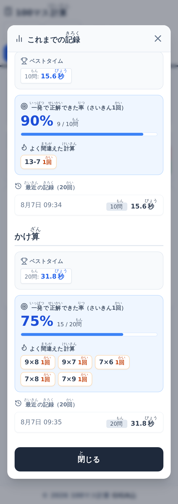

この端末では、かけ算で 9×8 と 7×8 を外していました。ここに出た式が、そのまま明日の宿題になります。

「とちゅうでやめた回数」も、あえて消さずに出しています。やめたことは失敗ではありません。「量が多すぎた」「まだ早かった」という、その子からの合図です。問題数を100問から50問に下げるだけで続くようになる子は、けっこういるのではないかと思っています。

記録は、その端末の中だけに残ります。外へは一切送りません。名前も出席番号も持っていないので、誰の記録かは端末を見ないと分かりません。学校の外に子どものデータが出ていくことを心配しなくて済むように、そもそも集めない作りにしました。

## ✨ 導入のメリット

三つのいいことが期待できます。

一つ目は、丸つけがなくなることです。40人ぶんのプリントを回収して赤ペンを入れて返す、という流れがまるごと消えます。その時間を、つまずいている子のとなりに座る時間に回せます。100マス計算を毎日やりたいけれど丸つけが続かなくてやめてしまった、という先生に、もう一度始めるきっかけになればと思って作りました。

二つ目は、子どもがまちがいに気づくのが「その場」になることです。翌日返ってきた赤い丸では、なぜまちがえたか思い出せません。書いた瞬間にやり直しになれば、そこで考え直します。この差は、一日あたりでは小さくても、毎日積み上がると大きいのではないかと思います。

三つ目は、準備が要らないことです。刷る紙も、答えの用紙も、集めて配る時間もありません。電子黒板に映して一斉に始めることもできます。

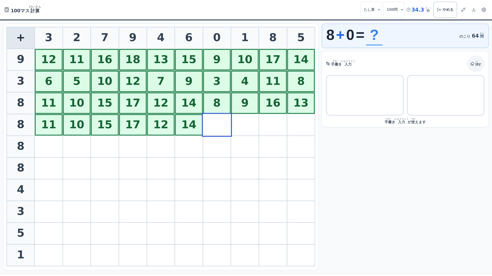

右上の「⤢」を押すと、文字とマスが大きくなって全画面になります。65インチから75インチの電子黒板で、教室のいちばんうしろの席からマスの数字が読める大きさです。もう一度押すか Esc キーでもとに戻ります。

紙が要る場面もあると思います。そのときのために、白紙のプリントとして刷れるようにしてあります。

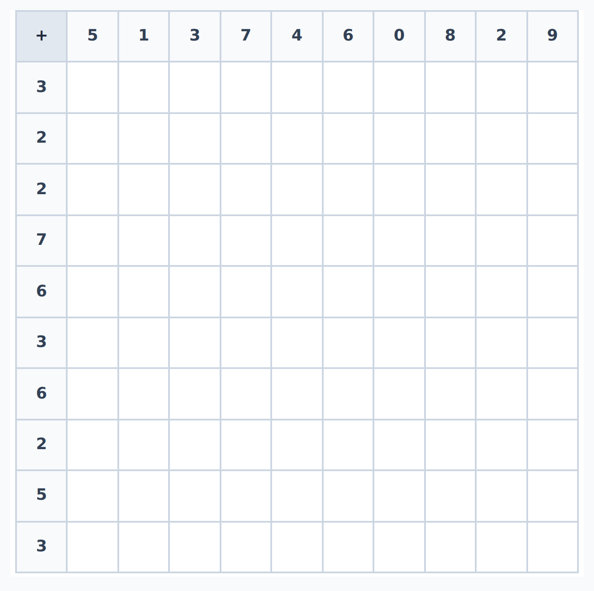

「スタート！」を押す前に印刷すると、1辺16ミリのマスだけが A4 縦1ページに出ます。ボタンやメニュー、手書きの欄は紙に出ません。端末が足りない日や、家庭学習に持たせたい日に使えます。

## 🛠️ 【管理者向け】導入手順

情報担当の先生に聞かれることを、先に書いておきます。

開くアドレスはこの1つです。

https://online-100square-calculation.giga-school.com/

校内のフィルタリングで許可が必要なのは online-100square-calculation.giga-school.com です。ここ以外の外部のサイトにはつなぎません。動かすためのプログラムを外部の配信元から取ってくることもしていないので、外部が塞がれている学校でも、機能が丸ごと使えなくなることがありません。

個人情報については、そもそも入力する画面がありません。氏名、出席番号、メールアドレス、どれも記録していません。取り組みの記録はその端末の中だけに残り、外へは送りません。児童名を扱わないので、電子黒板に映すときに伏せる情報もありません。

共用の端末で使う場合は、記録が混ざることだけご承知おきください。記録は端末ごとに残るので、同じ端末を別の子が使うと、同じところに積み上がります。ベストタイムを個人のものとして扱いたい場合は、端末を固定するか、記録を「クラスの記録」として見る使い方をおすすめします。

最初に読み込むのは22個のファイルで、あわせて約800キロバイトです。手書きの読み取りに使う部分はこれに含めておらず、手書きを使う設定にした端末だけが、あとから取りに行きます。校内の Wi-Fi に40人が同時につないでも、最初の表示で止まらないようにするためです。

端末にアプリとして入れておくと、次からはインターネットにつながっていなくても開けます。

Chromebook と Windows の場合。

1. Chrome か Edge でアドレスを開く
2. 画面右上に「アプリに追加」というボタンが出たら押す
3. 出ていないときは、アドレスバー右端の丸いしるし、またはメニューの「アプリをインストール」から入れる

iPad と iPhone の場合。

1. Safari でアドレスを開く
2. 画面下、または右上の共有ボタンを押す
3. メニューを下にスクロールして「ホーム画面に追加」を押す
4. 右上の「追加」を押す

iPad では、ホーム画面に追加しておくことをおすすめします。Safari は7日間使わなかったサイトの保存データを消すことがあり、ベストタイムの記録もそのとき消えます。ホーム画面に入れておくと消えにくくなります。

使っているうちに、画面の下に黒い帯で「あたらしい ばんが あります」と出ることがあります。押すまで切り替わりません。計算のとちゅうで押すと打ちかけの答えが消えるので、取り組みが終わってから押してください。授業のはじめに一度押しておくと、その時間は出てきません。

文字の形がいつもと違って見えることがありますが、これは学校のネットワークが外の文字データを止めているためで、動作には影響しません。端末に入っている文字で表示されます。

スマートフォンやタブレットを縦向きで使うときは、電子黒板に映すための大きい表示にしても、手書きの欄とテンキーは画面の幅いっぱいのままです。文字だけ大きくして入力のボタンが小さくなると、いちばん押しにくい形になってしまうためです。

よく聞かれることを3つだけ書いておきます。

1つ目は「AIの準備に失敗しました」と出るときです。手書きの読み取りの読み込みに失敗しています。設定で手書きを一度切って入れ直すと読み直します。それでも直らないときはボタン入力に切り替えてください。計算そのものは問題なく続けられます。

2つ目は、手書きの数字がうまく読まれないときです。枠いっぱいに、大きく太く書くと通りやすくなります。細く小さい字は、大人が書いても外れます。

3つ目は、マスが小さくて押しにくいときです。画面の幅に合わせて自動で大きさを決めているので、問題数を減らすか、端末を横向きにすると大きくなります。手書きかテンキーで入力していれば、マスを押さなくても自動で次に進むので、そもそも押す必要はありません。

費用はかかりません。広告も出ません。ログインも不要です。中身は MIT ライセンスで公開しているので、校内で自由にお使いいただけます。

## 📖 【利用者向け】使い方のガイド

子どもたちに説明するときの手順です。

1. アドレスを開きます。ブックマークかホーム画面に入れておくと早いです
2. 上のところで「たし算」「引き算」「かけ算」から1つ選びます
3. その右で問題数を選びます。10問から100問まで、10問きざみです
4. 「スタート！」を押します。ここから時間が測られます
5. 白い枠に、答えの数字を指で書きます。2桁の答えは、左の枠と右の枠に1文字ずつ書きます
6. 正解すると音が鳴って、次のマスに自動で進みます
7. まちがえると数字が消えます。もう一度書き直します
8. 全部のマスが埋まると終わりです。かかった時間が出ます
9. とちゅうでやめたいときは「やめる」を押します。そこまでの記録は残ります
10. 右上のグラフのしるしから、これまでの記録が見られます

設定を変えるときの手順です。

1. 右上の歯車のしるしを押します
2. 「音を鳴らす」を切ると、正解や不正解の音が鳴らなくなります
3. 「手書き入力を使う」を切ると、白い枠が消えます
4. 「ボタン入力を使う」を入れると、画面に大きなテンキーが出ます
5. 「すぐ判定」を切ると、全部書き終わってからまとめて丸つけになります
6. 「入力ツールの位置」で、手書きの欄とテンキーを左右どちらに置くか選べます
7. 「閉じる」を押します。設定はその端末に残るので、次に開いたときも同じです

電子黒板に映すときの手順です。

1. 右上の「⤢」のしるしを押します
2. 文字とマスが大きくなって、全画面になります
3. もとに戻すときは、もう一度押すか Esc キーを押します

白紙のプリントとして刷るときの手順です。

1. 「スタート！」を押す前の状態にしておきます
2. 計算の種類と問題数を選びます
3. ブラウザのメニューから「印刷」を選びます
4. プレビューで、表が1ページに収まっているか確かめます
5. 印刷します。マスの表だけが出て、ボタンや手書きの欄は出ません

## 📝 まとめ

ICT を使う理由は、速くすることそのものではないと思っています。速くなったぶんで何をするか、のほうが大事です。

100マス計算の丸つけに使っていた放課後の1時間が空いたとして、それで早く帰れるならそれもいいことですが、私が期待しているのはもう少し手前のところです。子どもが100マスを解いているあいだ、先生の手はあいています。赤ペンを持っていないので、教室を歩けます。手が止まっている子のとなりにしゃがんで、「どこでつまってる」と聞ける。それが、このアプリで生まれてほしい時間です。

記録の画面に出る「よく間違えた計算」も、集計のためではなく、その会話のために出しています。9×8が3回出ていたら、明日その子に9×8だけ聞いてみる。それだけで変わることは、たぶんあります。

作ってはみたものの、教室で使ってみないと分からないことはたくさん残っています。問題数の刻みが合っているか、手書きの読み取りが1年生の字でどこまで通じるか。使ってみて「ここが違う」と思われたら、ぜひ教えてください。

一歩踏み出そうとする先生を、私はいつでも全力で応援しています。
